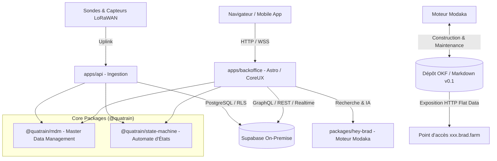

🏠 **[README](../../README.fr.md)** | 🗺️ **[Index Architecture](index.fr.md)** | ⬅️ **[Précédent : README](../../README.fr.md)** | ➡️ **[Suivant : Feuille de Route Globale](ROADMAP.fr.md)**

---

# Architecture Globale & Vue d'Ensemble — bradtech-oss

> 🌐 *English version available in [`ARCHITECTURE.md`](ARCHITECTURE.md)*

## 1. Principes Directeurs
- **Open Source First (AGPL-v3)** : Code public et auditable hébergé sous l'organisation GitHub **`bradtech-oss`**.
- **Réutilisation Écosystème Quatrain** : Maximisation de l'usage des paquets Quatrain Core, CoreUX et CoreApps (`@quatrain/*`).
- **Autonomie On-Premise** : Fonctionnement 100% autonome sur site sans dépendance cloud propriétaire via Supabase Self-Hosted.
- **Architecture Découplée (Code vs IaC)** : Clarté entre le code source applicatif dans `` et les recettes de déploiement dans `infra/`.
- **Moteur Modaka & Repositories OKF** : Gestion transparente des connaissances et publication Open Data sur sous-domaines dédiés **`xxx.brad.farm`**.

## 2. Découpage Fonctionnel

## 3. Composants Clés

### A. `@quatrain/mdm` (Master Data Management)
Paquet abstrait et générique fournissant un modèle universel d'équipements (`Device`), puces (`PCB`), boîtiers (`Enclosure`), capteurs (`Sensor`) et accessoires.

### B. `@quatrain/state-machine` (Automate à États Finis)
Moteur générique de FSM pour modéliser le cycle de vie des équipements (*Planned, Ordered, Available, Associated, Maintenance, Ko, Scrapped*) et les réalités physiques (*Parcelles, Bassins d'aquaculture, Bâtiments d'élevage, Silos/Stockages*).

### C. `@bradtech-oss/hey-brad` (Moteur IA Modaka & OKF)
Moteur d'assistance IA basé sur Modaka construisant un répertoire OKF (Open Knowledge Format v0.1) et exposant les données ouvertes sur `https://<tenant>.brad.farm`.

### D. Supabase On-Premise (`@bradtech-oss/db`)
Base de données PostgreSQL réécrite avec identifiants uniques 100% UUID v4 (`uid`), extension `pgvector` et politiques de sécurité Row-Level Security (RLS).

---
🏠 **[README](../../README.fr.md)** | 🗺️ **[Index Architecture](index.fr.md)** | ⬅️ **[Précédent : README](../../README.fr.md)** | ➡️ **[Suivant : Feuille de Route Globale](ROADMAP.fr.md)**
