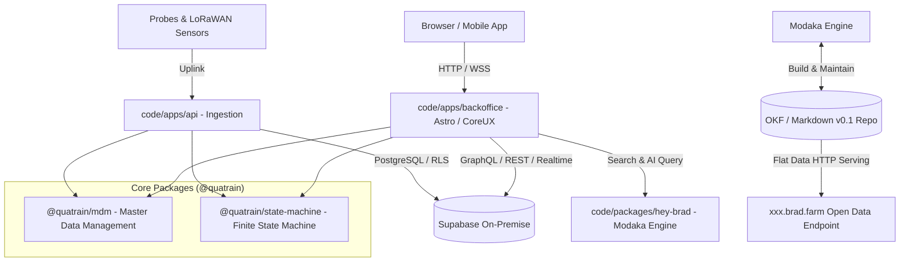

# System Architecture Overview — bradtech-oss

> 🌐 *Version française disponible dans [`ARCHITECTURE.fr.md`](ARCHITECTURE.fr.md)*

## 1. Core Guiding Principles
- **Open Source First (AGPL-v3)**: Fully open, public, and auditable code hosted under the **`bradtech-oss`** GitHub organization.
- **Quatrain Ecosystem Reusability**: Maximum utilization of Quatrain Core, CoreUX, and CoreApps packages (`@quatrain/*`).
- **On-Premise Autonomy**: 100% self-hosted on-site operation without proprietary cloud dependencies via Self-Hosted Supabase.
- **Decoupled Architecture (Code vs IaC)**: Explicit separation between application source code in `code/` and deployment infrastructure recipes in `infra/`.
- **Modaka Engine & OKF Repositories**: Transparent knowledge management based on Open Knowledge Format (OKF v0.1) and flat Open Data publishing on dedicated **`xxx.brad.farm`** tenant endpoints.

## 2. Functional Component Diagram

## 3. Key Subsystems

### A. `@quatrain/mdm` (Master Data Management)
Abstract, domain-agnostic package providing a unified data model for `Device`, `PCB`, `Enclosure`, `Sensor`, and `Accessory` entities.

### B. `@quatrain/state-machine` (Universal Finite State Machine)
Reactive FSM engine modeling the lifecycle transitions of hardware devices (*Planned, Ordered, Available, Associated, Maintenance, Ko, Scrapped*) and physical realities (*Agricultural Plots, Aquaculture Ponds, Livestock Barns, Storage Silos*).

### C. `@bradtech-oss/hey-brad` (Modaka Engine & OKF Core)
Modaka-based AI engine constructing an Open Knowledge Format (OKF v0.1) repository and publishing flat Open Data feeds on `https://<tenant>.brad.farm`.

### D. Supabase On-Premise (`@bradtech-oss/db`)
Redesigned PostgreSQL schema using 100% UUID v4 (`uid`) primary keys, `pgvector` embeddings, and strict Row-Level Security (RLS) policies.

---
🏠 **[README](../../README.md)** | 🗺️ **[Architecture Index](index.md)** | ⬅️ **[Previous: README](../../README.md)** | ➡️ **[Next: Global Roadmap](ROADMAP.md)**
