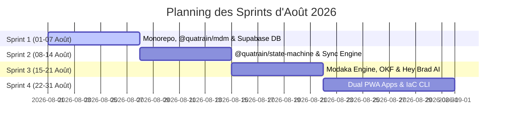

🏠 **[README](../../README.fr.md)** | 🗺️ **[Index Architecture](index.fr.md)** | ⬅️ **[Précédent : Feuille de Route Globale](ROADMAP.fr.md)** | ➡️ **[Suivant : Side Roadmap & UX PWA](SIDE_ROADMAP_AND_UX.fr.md)**
---

# Feuille de Route Détaillée — Mois d'Août 2026 (Sprints Hebdomadaires & Sessions de 2-3h)

> 🌐 *English version available in [`AUGUST_2026_SPRINT_ROADMAP.md`](AUGUST_2026_SPRINT_ROADMAP.md)*

> [!IMPORTANT]
> **Règle de Stabilité Stricte :** Chaque session de travail de 2 à 3 heures doit s'achever par un build propre, des tests unitaires validés à 100%, et laisser l'intégralité du stack Quatrain / Brad dans un **état parfaitement stable et fonctionnel**.

---

## 🗓️ Calendrier des Sprints d'Août 2026

---

## 🏃 Sprint 1 : Fondations Monorepo, `@quatrain/mdm` & Supabase DB (01 - 07 Août)

### 🔹 Session 1.1 (2h30) — Initialisation du Monorepo `bradtech-oss`
- **Objectif** : Structurer l'arborescence `code/` et `infra/`, configurer `package.json`, `turbo.json`, `.yarnrc.yml`, `tsconfig.json`.
- **Livrables** : Monorepo fonctionnel avec `yarn install` et `yarn build` sans erreur.
- **Vérification de Stabilité** : Build complet du monorepo validé.

### 🔹 Session 1.2 (2h30) — Développement du Paquet Fondateur `@quatrain/mdm`
- **Objectif** : Créer `code/packages/mdm` avec les interfaces et validations Zod pour `Device`, `Component`, `Sensor` et `BaseEntity`.
- **Livrables** : Tests unitaires Zod et export des types TypeScript.
- **Vérification de Stabilité** : `yarn test --filter=@quatrain/mdm` passe à 100%.

### 🔹 Session 1.3 (3h00) — Schéma Supabase On-Premise & Migrations (`@bradtech-oss/db`)
- **Objectif** : Rédiger les migrations SQL 100% UUID v4 (`uid`) pour `tenants`, `devices`, `realities`, `telemetry_measures`, et activer `pgvector`.
- **Livrables** : Migrations exécutables via CLI Supabase local.
- **Vérification de Stabilité** : `supabase db reset` s'exécute sans erreur.

### 🔹 Session 1.4 (2h30) — Sécurité Row-Level Security (RLS) & Données de Test (Seeds)
- **Objectif** : Écrire les politiques RLS multi-tenant et créer les scripts de seed pour la recette.
- **Livrables** : Script de seed `seed.sql` et règles RLS appliquées.
- **Vérification de Stabilité** : Connexion multi-tenant validée par tests d'intégration.

---

## 🏃 Sprint 2 : `@quatrain/state-machine` & Moteur ETL Bi-Système (08 - 14 Août)

### 🔹 Session 2.1 (2h30) — Développement de `@quatrain/state-machine` (Automate Équipements)
- **Objectif** : Créer le paquet `code/packages/state-machine` et modéliser l'automate FSM pour le cycle de vie des `Devices` (*Planned*, *Available*, *Associated*, *Maintenance*, *Ko*).
- **Livrables** : Moteur FSM réactif avec typage strict.
- **Vérification de Stabilité** : Suite de tests FSM réactifs validée.

### 🔹 Session 2.2 (2h30) — Automate à États des Réalités Métier (`Realities`)
- **Objectif** : Étendre `@quatrain/state-machine` pour gérer les transitions d'états des réalités (*Parcelles, Élevages, Bassins, Silos*).
- **Livrables** : Configurations FSM métiers exportées.
- **Vérification de Stabilité** : Tests d'intégration des transitions métiers validés.

### 🔹 Session 2.3 (3h00) — Moulinette de Migration Historique (`@bradtech-oss/sync-engine`)
- **Objectif** : Écrire le script d'ETL v1 pour convertir les tables legacy (`probes`, `weather-stations`, `plots`) vers le modèle `@quatrain/mdm` et `realities` UUID v4.
- **Livrables** : Script CLI `yarn sync:bulk`.
- **Vérification de Stabilité** : Conversion de la base d'essai validée sans perte de données.

### 🔹 Session 2.4 (2h30) — Synchronisation Temps Réel CDC & Scripts de Réconciliation
- **Objectif** : Mettre en place la réplication des Change Data Streams (CDC) et le script de vérification de parité à 100%.
- **Livrables** : Script `yarn sync:reconcile`.
- **Vérification de Stabilité** : Comparateur de parité à 100% validé.

---

## 🏃 Sprint 3 : Moteur Modaka, Curation OKF & Cœur IA Hey Brad (15 - 21 Août)

### 🔹 Session 3.1 (2h30) — Moteur Modaka & Parser OKF v0.1 (`@bradtech-oss/hey-brad`)
- **Objectif** : Implémenter le parser/générateur de documents Markdown OKF v0.1 avec en-têtes YAML et liens sémantiques.
- **Livrables** : Parser OKF typé et testé.
- **Vérification de Stabilité** : Validation du formatage OKF par tests unitaires.

### 🔹 Session 3.2 (3h00) — Curation Bookworm OKF & Outil d'Extraction/Initialisation Site
- **Objectif** : Organiser le corpus Bookworm en OKF et créer la moulinette d'extraction pour initialiser les instances personnelles Modaka (`https://<tenant>.brad.farm`).
- **Livrables** : Outil CLI `yarn bookworm:slice --tenant "chateau-margaux"`.
- **Vérification de Stabilité** : Génération d'un sous-ensemble OKF valide vérifiée.

### 🔹 Session 3.3 (2h30) — Intégration du Cœur IA Hey Brad (Modaka SaaS)
- **Objectif** : Implémenter les outils LLM Tool-Calling (`get_reality_status`, `query_sensor_history`, `search_okf_documents`).
- **Livrables** : Moteur IA conversationnel opérationnel.
- **Vérification de Stabilité** : Mocking des appels LLM validé avec succès.

### 🔹 Session 3.4 (2h30) — Serveur HTTP Open Data (`xxx.brad.farm`) & Contrôle d'Accès ACL
- **Objectif** : Développer le serveur d'exposition HTTP des données OKF à plat avec modes libre (Open Data) et restreint (ACL/JWT).
- **Livrables** : Endpoint HTTP autonome.
- **Vérification de Stabilité** : Tests d'accès HTTP Public vs ACL validés.

---

## 🏃 Sprint 4 : Écosystème Apps PWA (Backoffice/Mobile) & Outillage IaC (22 - 31 Août)

### 🔹 Session 4.1 (3h00) — Application Backoffice UI PWA (`code/apps/backoffice`)
- **Objectif** : Créer l'application Astro PWA Backoffice optimisée pour PC de bureau, Laptops et Tablettes avec les composants Quatrain CoreUX.
- **Livrables** : Interface d'administration responsive complète.
- **Vérification de Stabilité** : Build Astro PWA sans avertissement ni erreur.

### 🔹 Session 4.2 (2h30) — Application Mobile PWA Terrain (`code/apps/mobile`)
- **Objectif** : Créer l'application Astro PWA épurée optimisée pour Smartphones et Tablettes.
- **Livrables** : Application Mobile PWA autonome.
- **Vérification de Stabilité** : Service Worker PWA et manifeste validés.

### 🔹 Session 4.3 (2h30) — Intégration UX Hybride (Données + Carto SIG + Conversational)
- **Objectif** : Assembler les vues modulaires combinant briques de données KPI, cartes SIG interactives et fil de discussion Hey Brad.
- **Livrables** : Composants UX hybrides réutilisables.
- **Vérification de Stabilité** : Rendu dynamique cartographique et chat validé.

### 🔹 Session 4.4 (3h00) — Pile LoRaWAN Souveraine & Outil CLI de Configuration (`infra/tools`)
- **Objectif** : Embarquer la pile ChirpStack (`infra/lorawan-server`) et développer l'outil CLI interactif `yarn setup`.
- **Livrables** : Générateur de clés secrètes et d'archives Dragino.
- **Vérification de Stabilité** : Génération d'un kit complet de site validée.

### 🔹 Session 4.5 (2h30) — Recettes IaC (Podman, Helm & ArgoCD) & Recette Globale
- **Objectif** : Rédiger et valider le `podman-compose.yml`, la charte Helm et le manifest ArgoCD ApplicationSet.
- **Livrables** : Pack IaC complet.
- **Vérification de Stabilité** : `helm template` et `podman-compose config` validés sans erreur.

---
🏠 **[README](../../README.fr.md)** | 🗺️ **[Index Architecture](index.fr.md)** | ⬅️ **[Précédent : Feuille de Route Globale](ROADMAP.fr.md)** | ➡️ **[Suivant : Side Roadmap & UX PWA](SIDE_ROADMAP_AND_UX.fr.md)**
