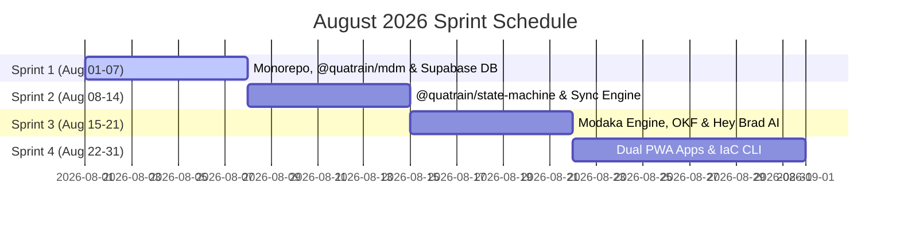

🏠 **[README](../../README.md)** | 🗺️ **[Architecture Index](index.md)** | ⬅️ **[Previous: Global Roadmap](ROADMAP.md)** | ➡️ **[Next: Side Roadmap & PWA UX](SIDE_ROADMAP_AND_UX.md)**
---

# Refined August 2026 Sprint Roadmap (Weekly Sprints & 2-3h Work Sessions)

> 🌐 *Version française disponible dans [`AUGUST_2026_SPRINT_ROADMAP.fr.md`](AUGUST_2026_SPRINT_ROADMAP.fr.md)*

> [!IMPORTANT]
> **Strict System Stability Rule:** Every single 2-to-3 hour work session MUST conclude with a clean build, 100% passing unit/integration tests, and leave the entire Quatrain / Brad tech stack in a **fully working, stable, and production-ready state**.

---

## 🗓️ August 2026 Sprint Schedule Overview

---

## 🏃 Sprint 1: Monorepo Foundation, `@quatrain/mdm` & Supabase DB (Aug 01 - 07)

### 🔹 Session 1.1 (2h30) — `bradtech-oss` Monorepo Setup & Tooling
- **Goal**: Initialize `` and `infra/` folder hierarchies, root `package.json`, `turbo.json`, `.yarnrc.yml`, `tsconfig.json`, and AGPL-v3 license.
- **Deliverables**: Working monorepo building cleanly with `yarn build`.
- **Stability Check**: Clean monorepo build confirmed.

### 🔹 Session 1.2 (2h30) — `@quatrain/mdm` Core Package Development
- **Goal**: Create `packages/mdm` with Zod schema definitions and TypeScript interfaces for `Device`, `Component`, `Sensor`, and `BaseEntity`.
- **Deliverables**: Tested Zod schemas and exported TypeScript interfaces.
- **Stability Check**: `yarn test --filter=@quatrain/mdm` passes 100%.

### 🔹 Session 1.3 (3h00) — Supabase On-Premise Schema & Migrations (`@bradtech-oss/db`)
- **Goal**: Write versioned SQL migrations using 100% UUID v4 (`uid`) primary keys for `tenants`, `devices`, `realities`, `telemetry_measures`, and enable `pgvector`.
- **Deliverables**: Executable Supabase migration files.
- **Stability Check**: Local `supabase db reset` succeeds with zero errors.

### 🔹 Session 1.4 (2h30) — Row-Level Security (RLS) Policies & Test Seeds
- **Goal**: Implement multi-tenant RLS policies and create development seed data scripts.
- **Deliverables**: Multi-tenant seed SQL script and enforced RLS policies.
- **Stability Check**: Multi-tenant database isolation verified via integration tests.

---

## 🏃 Sprint 2: `@quatrain/state-machine` & Dual-System ETL Engine (Aug 08 - 14)

### 🔹 Session 2.1 (2h30) — `@quatrain/state-machine` Development (Device FSM)
- **Goal**: Create `packages/state-machine` modeling the finite state machine for `Device` lifecycles (*Planned*, *Available*, *Associated*, *Maintenance*, *Ko*).
- **Deliverables**: Strongly-typed reactive FSM engine.
- **Stability Check**: Reactive FSM state transition test suite passing 100%.

### 🔹 Session 2.2 (2h30) — Domain Reality Finite State Machine Models (`Realities`)
- **Goal**: Extend `@quatrain/state-machine` to govern state transitions for domain realities (*Plots, Livestock Barns, Aquaculture Ponds, Storage Silos*).
- **Deliverables**: Exported domain reality FSM configurations.
- **Stability Check**: Domain state transition integration tests verified.

### 🔹 Session 2.3 (3h00) — Historical Data Bulk Migration Utility (`@bradtech-oss/sync-engine`)
- **Goal**: Build v1 bulk ETL script converting legacy tables (`probes`, `weather-stations`, `plots`) into `@quatrain/mdm` and UUID v4 `realities`.
- **Deliverables**: CLI executable `yarn sync:bulk`.
- **Stability Check**: Zero data loss bulk conversion verified on test database.

### 🔹 Session 2.4 (2h30) — Real-Time CDC Mirroring & Reconciliation Checker
- **Goal**: Set up Supabase PostgreSQL Change Data Capture (CDC) replication and 100% parity verification script.
- **Deliverables**: CLI executable `yarn sync:reconcile`.
- **Stability Check**: 100% data reconciliation checker passing cleanly.

---

## 🏃 Sprint 3: Modaka Engine, OKF Curation & Hey Brad AI Core (Aug 15 - 21)

### 🔹 Session 3.1 (2h30) — Modaka Engine & OKF v0.1 Document Parser (`@bradtech-oss/hey-brad`)
- **Goal**: Implement OKF v0.1 Markdown parser and generator with flat YAML headers and semantic cross-linking.
- **Deliverables**: Typed OKF parser utility.
- **Stability Check**: OKF formatting unit tests passing 100%.

### 🔹 Session 3.2 (3h00) — Bookworm Master OKF Curation & Tenant Slicing Tool
- **Goal**: Structure Bookworm agronomic manuals into OKF format and build tenant extraction tool for personal Modaka instances (`https://<tenant>.brad.farm`).
- **Deliverables**: CLI tool `yarn bookworm:slice --tenant "chateau-margaux"`.
- **Stability Check**: Slice extraction verified producing valid OKF document trees.

### 🔹 Session 3.3 (2h30) — Hey Brad AI Core Integration (Modaka SaaS)
- **Goal**: Implement LLM Function Tool-calling (`get_reality_status`, `query_sensor_history`, `search_okf_documents`).
- **Deliverables**: Working conversational AI engine.
- **Stability Check**: LLM tool calling suite passing with mocked responses.

### 🔹 Session 3.4 (2h30) — Open Data HTTP Endpoint (`xxx.brad.farm`) & ACL Security
- **Goal**: Build HTTP server for flat OKF document serving supporting Open Data (public) and ACL-restricted modes.
- **Deliverables**: Standalone HTTP server endpoint.
- **Stability Check**: Open Data vs ACL restricted HTTP endpoints verified.

---

## 🏃 Sprint 4: Dual PWA UX Apps (Backoffice/Mobile) & IaC Setup Tooling (Aug 22 - 31)

### 🔹 Session 4.1 (3h00) — Backoffice UI PWA Application (`apps/backoffice`)
- **Goal**: Build Astro PWA Backoffice web app optimized for Desktop PCs, Laptops, and Tablets using Quatrain CoreUX.
- **Deliverables**: Complete responsive administration web dashboard.
- **Stability Check**: Astro PWA build completing cleanly with 0 errors.

### 🔹 Session 4.2 (2h30) — Field Mobile PWA Application (`apps/mobile`)
- **Goal**: Build lightweight Astro PWA mobile app optimized for Smartphones and Tablets.
- **Deliverables**: Standalone mobile PWA application.
- **Stability Check**: PWA Service Worker and manifest verified.

### 🔹 Session 4.3 (2h30) — Hybrid UX Integration (Data + Cartography SIG + Conversational)
- **Goal**: Assemble modular views combining KPI data blocks, interactive GIS maps, and Hey Brad chat dialog threads.
- **Deliverables**: Reusable hybrid UX layout components.
- **Stability Check**: Dynamic cartographic rendering and chat interactions verified.

### 🔹 Session 4.4 (3h00) — Sovereign LoRaWAN Stack & Setup CLI Generator (`infra/tools`)
- **Goal**: Package embedded ChirpStack stack (`infra/lorawan-server`) and build interactive CLI tool `yarn setup`.
- **Deliverables**: Secret generator & Dragino backup archive builder.
- **Stability Check**: Complete site deployment bundle generation verified.

### 🔹 Session 4.5 (2h30) — IaC Recipes (Podman, Helm & ArgoCD) & Global Dry Run
- **Goal**: Finalize and validate `podman-compose.yml`, Helm Chart, and ArgoCD ApplicationSet.
- **Deliverables**: Complete IaC deployment suite.
- **Stability Check**: `helm template` and `podman-compose config` passing 100%.

---
🏠 **[README](../../README.md)** | 🗺️ **[Architecture Index](index.md)** | ⬅️ **[Previous: Global Roadmap](ROADMAP.md)** | ➡️ **[Next: Side Roadmap & PWA UX](SIDE_ROADMAP_AND_UX.md)**
