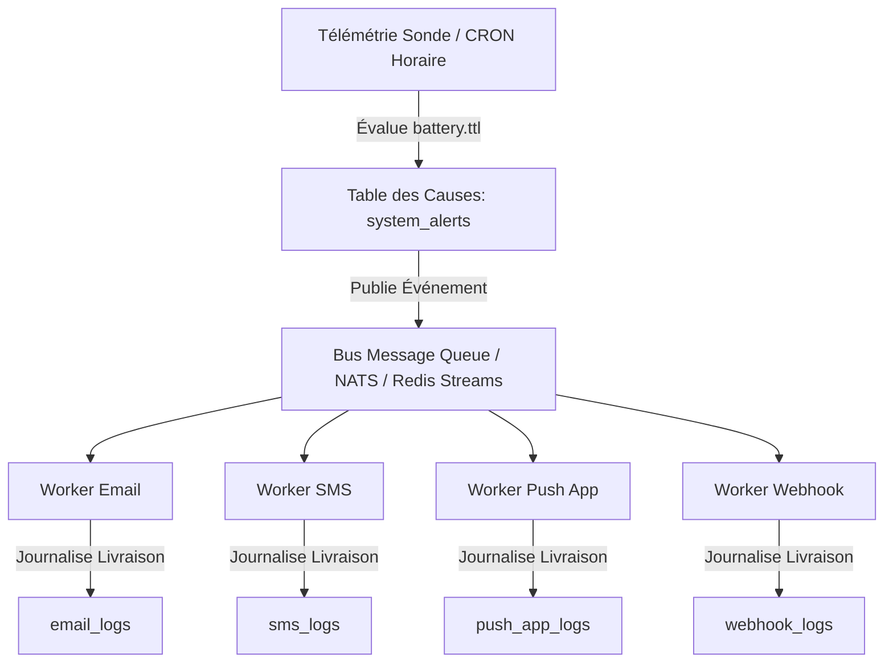

# Spécification d'Architecture : TTL Batterie Dynamique & Système d'Alertes Événementiel

> 🌐 *Version anglaise disponible dans [`BATTERY_TTL_AND_ALERT_SYSTEM.md`](BATTERY_TTL_AND_ALERT_SYSTEM.md)*  
> **Identifiant du Document :** SPEC-013-BATTERY-ALERT  
> **Version Cible :** `bradtech-oss v1.0.0` (Réécriture Plateforme Open Source)  
> **Licence :** AGPL-v3  
> **Dernière Mise à Jour :** 12 août 2026  

---

## 1. Résumé Exécutif & Objectifs de la Réécriture Open Source

Dans le cadre de la réécriture globale de la plateforme **`bradtech-oss`**, ce document spécifie :
1. **La prévision dynamique à 2 points du TTL Batterie** (`battery.ttl` exprimé en jours restants) pour toutes les sondes de sol et stations météo autonomes.
2. **L'architecture du système d'alertes événementiel découplé** séparant les causes d'alerte matériel (`system_alerts`) de la diffusion multi-canaux configurable par les utilisateurs (Email, SMS, Push App, Webhooks) et des journaux d'envoi (`channel_delivery_logs`).

---

## 2. Algorithme d'Estimation Dynamique du TTL Batterie à 2 Points

### 2.1 Plage Opérationnelle Matérielle (BradOS / Spécification LoRaWAN 5.5)

Le firmware des équipements (`BradOS`) mesure la tension batterie par CAN et transmet le pourcentage via la commande MAC LoRaWAN standard `DevStatusAns` :

- **Tension Maximale ($V_{\text{pleine}}$)** : `4.2V` (100 % / `0xFE`)
- **Tension Nominale Vide ($V_{\text{vide}}$)** : `3.3V` (0 % / `0x01`)
- **Seuil de Coupure Matériel ($V_{\text{coupure}}$)** : `3.2V` (En dessous de 3.2V, le régulateur LDO et la puce radio SX1262 s'arrêtent pour prévenir les brownouts).

### 2.2 Calcul Dynamique de la Décharge à 2 Points

Au lieu d'appliquer une pente théorique uniforme (alors que les équipements subissent des températures, des Spreading Factors LoRaWAN SF7–SF12 et des réémissions radio très différentes), le temps restant estimé en jours (`battery.ttl`) est calculé dynamiquement à partir de deux observations temporelles :

- **Relevé Actuel ($P_{\text{actuel}}, t_{\text{actuel}}$)** : Dernier pourcentage de batterie connu.
- **Relevé Historique à $-7$ jours ($P_{-7\text{j}}, t_{-7\text{j}}$)** : Pourcentage enregistré en base/IndexedDB/Redis $\approx 7$ jours auparavant.

#### Taux de Décharge Quotidien ($r$) :

$$\Delta P = P_{-7\text{j}} - P_{\text{actuel}}$$

$$\Delta t = \frac{t_{\text{actuel}} - t_{-7\text{j}}}{86400 \text{ sec}} \quad (\text{intervalle en jours})$$

$$r = \frac{\Delta P}{\Delta t} \quad (\% \text{ consommé par jour})$$

#### Durée de Vie Restante en Jours (`battery.ttl`) :

$$\text{battery.ttl} = \max\left(0, \text{arrondi}\left( \frac{P_{\text{actuel}} - P_{\text{coupure}}}{r} \right)\right)$$

*où $P_{\text{coupure}} = 0\%$ (seuil d'arrêt matériel à $V \le 3.2\text{V}$).*

#### Règles de Repli (Fallback) :
- **Absence d'Historique à 7 jours** (nouvelle sonde) : Utilise l'intervalle disponible ($t \ge 1\text{j}$) ou l'autonomie nominale par défaut ($100\% = 1095 \text{ jours}$).
- **Décharge Non Significative ou Charge Solaire ($\Delta P \le 0$)** : Applique l'autonomie maximale nominale de référence (1095 jours / 3 ans).

---

## 3. Système d'Alertes Découplé (Cause vs Notification)



### 3.1 Codes d'Alerte Standardisés

Les événements d'alerte batterie utilisent des codes structurés et normalisés :

- **`battery.alert.90`** : Pré-alerte 3 mois restants ($\text{TTL} \le 90 \text{ jours}$)
- **`battery.alert.30`** : Alerte 1 mois restant ($\text{TTL} \le 30 \text{ jours}$)
- **`battery.alert.15`** : Alerte critique 15 jours restants ($\text{TTL} \le 15 \text{ jours}$)
- **`battery.alert.7`**  : Alerte d'urgence 7 jours restants ($\text{TTL} \le 7 \text{ jours}$)

### 3.2 Schéma de la Table des Causes (`system_alerts`)

Chaque cause d'alerte déclenchée par un équipement est enregistrée de manière permanente dans la base PostgreSQL, indépendamment de la configuration de notification de l'utilisateur :

```sql
CREATE TABLE IF NOT EXISTS public.system_alerts (
    id UUID PRIMARY KEY DEFAULT gen_random_uuid(),
    code VARCHAR(64) NOT NULL,                    -- ex: 'battery.alert.90'
    device_serial_number VARCHAR(64) NOT NULL,   -- ex: 'b26s001'
    device_type VARCHAR(32) NOT NULL DEFAULT 'Probe',  -- Probe, WeatherStation, Gateway
    tenant_id UUID REFERENCES public.tenants(id) ON DELETE SET NULL,
    details JSONB NOT NULL DEFAULT '{}'::jsonb,   -- { batteryPercentage, batteryTtlDays, thresholdDays }
    triggered_at TIMESTAMPTZ NOT NULL DEFAULT NOW(),
    CONSTRAINT unique_device_alert_code UNIQUE (device_serial_number, code)
);
```

### 3.3 Journaux d'Audit de Livraison par Canal

Les workers spécifiques à chaque canal consignent les tentatives de livraison dans leurs tables de suivi respectives :

```sql
CREATE TABLE IF NOT EXISTS public.channel_delivery_logs (
    id UUID PRIMARY KEY DEFAULT gen_random_uuid(),
    system_alert_id UUID REFERENCES public.system_alerts(id) ON DELETE CASCADE,
    code VARCHAR(64) NOT NULL,
    channel VARCHAR(32) NOT NULL, -- 'email', 'sms', 'push_app', 'webhook'
    recipient VARCHAR(255) NOT NULL,
    status VARCHAR(32) NOT NULL,  -- 'pending', 'sent', 'failed'
    error_details TEXT,
    sent_at TIMESTAMPTZ NOT NULL DEFAULT NOW()
);
```

---

## 4. Restitution dans les Payloads Webhooks

Le TTL recalculé est automatiquement transmis dans tous les payloads Webhook sortants :

```json
{
  "event": "probe.telemetry.updated",
  "timestamp": "2026-08-12T15:00:00.000Z",
  "probe": {
    "serialNumber": "b26s001",
    "name": "Sonde Potager d'Hiver",
    "batteryPercentage": 94,
    "batteryTtlDays": 1029
  },
  "measures": {
    "battery.ttl": {
      "value": 1029,
      "unit": "d"
    },
    "soilMoisture_15cm": {
      "value": 31.6,
      "unit": "%"
    }
  }
}
```

---

## 5. Sommaire & Documents d'Architecture Associés

- 📐 **[Vue d'Ensemble de l'Architecture](ARCHITECTURE.fr.md)** (`ARCHITECTURE.fr.md`)
- 🏛️ **[Ontologie des Données Structurées](DATA_ONTOLOGY_AND_MULTIMODAL.fr.md)** (`DATA_ONTOLOGY_AND_MULTIMODAL.fr.md`)
- 🗄️ **[Schéma PostgreSQL Supabase On-Premise](SUPABASE_ONPREM_SCHEMA.fr.md)** (`SUPABASE_ONPREM_SCHEMA.fr.md`)
