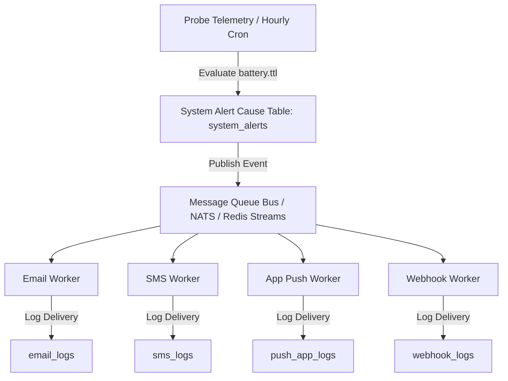

# Architecture Specification: Dynamic Battery TTL & Event-Driven Alert System

> 🌐 *French version available in [`BATTERY_TTL_AND_ALERT_SYSTEM.fr.md`](BATTERY_TTL_AND_ALERT_SYSTEM.fr.md)*  
> **Document ID:** SPEC-013-BATTERY-ALERT  
> **Target Release:** `bradtech-oss v1.0.0` (Open Source Platform Rewrite)  
> **License:** AGPL-v3  
> **Updated:** August 12, 2026  

---

## 1. Executive Summary & Open Source Rewrite Goals

As part of the **`bradtech-oss`** platform rewrite, this specification defines:
1. **Dynamic 2-Point Battery TTL Estimation** (`battery.ttl` in days) for all autonomous soil probes and weather stations.
2. **Event-Driven Alert System Architecture** decoupling hardware/system alert causes (`system_alerts`) from user-configurable multi-channel notifications (Email, SMS, Push App, Webhooks) and delivery logs (`channel_delivery_logs`).

---

## 2. Dynamic 2-Point Battery TTL Estimation Algorithm

### 2.1 Hardware Operating Boundaries (BradOS / LoRaWAN Spec 5.5)

Hardware firmware (`BradOS`) measures battery voltage across ADC readings and reports battery percentage via standard LoRaWAN `DevStatusAns` MAC commands:

- **Maximum Voltage ($V_{\text{full}}$)**: `4.2V` (100% / `0xFE`)
- **Nominal Empty Voltage ($V_{\text{empty}}$)**: `3.3V` (0% / `0x01`)
- **Hardware Cutoff Voltage ($V_{\text{cutoff}}$)**: `3.2V` (Under 3.2V, LDO regulator brownouts disable the SX1262 LoRa transceiver and ESP32 MCU).

### 2.2 Dynamic 2-Point Discharge Calculation

Rather than applying a static decay rate across all devices (which experience varying field temperatures, LoRaWAN Spreading Factors SF7–SF12, and RF retransmissions), remaining battery lifetime in days (`battery.ttl`) is calculated dynamically using two temporal observations:

- **Current Reading ($P_{\text{current}}, t_{\text{current}}$)**: Latest battery percentage.
- **Historical Reading 7 Days Ago ($P_{-7\text{d}}, t_{-7\text{d}}$)**: Reading from database/IndexedDB/Redis state recorded $\approx 7$ days prior.

#### Daily Discharge Rate ($r$):

$$\Delta P = P_{-7\text{d}} - P_{\text{current}}$$

$$\Delta t = \frac{t_{\text{current}} - t_{-7\text{d}}}{86400 \text{ sec}} \quad (\text{interval in days})$$

$$r = \frac{\Delta P}{\Delta t} \quad (\% \text{ consumed per day})$$

#### Remaining Lifespan in Days (`battery.ttl`):

$$\text{battery.ttl} = \max\left(0, \text{round}\left( \frac{P_{\text{current}} - P_{\text{cutoff}}}{r} \right)\right)$$

*where $P_{\text{cutoff}} = 0\%$ (operational cutoff at $V \le 3.2\text{V}$).*

#### Fallback Rules:
- **No 7-Day History Available** (new probe): Uses the available time interval ($t \ge 1\text{d}$) or falls back to nominal baseline ($100\% = 1095 \text{ days}$).
- **Non-Positive Discharge ($\Delta P \le 0$)**: If no discharge is observed or probe is charging, defaults to nominal maximum baseline (1095 days / 3 years).

---

## 3. Event-Driven Alert System (Cause vs Notification Decoupling)



### 3.1 Standardized Alert Codes

Battery alert events use standardized, structured codes:

- **`battery.alert.90`**: 3-Month Early Warning ($\text{TTL} \le 90 \text{ days}$)
- **`battery.alert.30`**: 1-Month Notice ($\text{TTL} \le 30 \text{ days}$)
- **`battery.alert.15`**: 15-Day Critical Alert ($\text{TTL} \le 15 \text{ days}$)
- **`battery.alert.7`**: 7-Day Emergency Alert ($\text{TTL} \le 7 \text{ days}$)

### 3.2 System Alert Cause Schema (`system_alerts`)

Every alert cause triggered by an equipment condition is permanently logged in PostgreSQL, regardless of user notification settings:

```sql
CREATE TABLE IF NOT EXISTS public.system_alerts (
    id UUID PRIMARY KEY DEFAULT gen_random_uuid(),
    code VARCHAR(64) NOT NULL,                    -- e.g. 'battery.alert.90'
    device_serial_number VARCHAR(64) NOT NULL,   -- e.g. 'b26s001'
    device_type VARCHAR(32) NOT NULL DEFAULT 'Probe',  -- Probe, WeatherStation, Gateway
    tenant_id UUID REFERENCES public.tenants(id) ON DELETE SET NULL,
    details JSONB NOT NULL DEFAULT '{}'::jsonb,   -- { batteryPercentage, batteryTtlDays, thresholdDays }
    triggered_at TIMESTAMPTZ NOT NULL DEFAULT NOW(),
    CONSTRAINT unique_device_alert_code UNIQUE (device_serial_number, code)
);
```

### 3.3 Channel Delivery Audit Logs

Channel-specific workers log actual delivery attempts to their respective audit tables:

```sql
CREATE TABLE IF NOT EXISTS public.channel_delivery_logs (
    id UUID PRIMARY KEY DEFAULT gen_random_uuid(),
    system_alert_id UUID REFERENCES public.system_alerts(id) ON DELETE CASCADE,
    code VARCHAR(64) NOT NULL,
    channel VARCHAR(32) NOT NULL, -- 'email', 'sms', 'push_app', 'webhook'
    recipient VARCHAR(255) NOT NULL,
    status VARCHAR(32) NOT NULL,  -- 'pending', 'sent', 'failed'
    error_details TEXT,
    sent_at TIMESTAMPTZ NOT NULL DEFAULT NOW()
);
```

---

## 4. Webhook Payload Restitution

The computed `battery.ttl` is included in all outbound webhook payloads:

```json
{
  "event": "probe.telemetry.updated",
  "timestamp": "2026-08-12T15:00:00.000Z",
  "probe": {
    "serialNumber": "b26s001",
    "name": "Sonde Potager d'Hiver",
    "batteryPercentage": 94,
    "batteryTtlDays": 1029
  },
  "measures": {
    "battery.ttl": {
      "value": 1029,
      "unit": "d"
    },
    "soilMoisture_15cm": {
      "value": 31.6,
      "unit": "%"
    }
  }
}
```

---

## 5. Summary & Related Architecture Documents

- 📐 **[System Architecture Overview](ARCHITECTURE.md)** (`ARCHITECTURE.md`)
- 🏛️ **[Structured Data Ontology](DATA_ONTOLOGY_AND_MULTIMODAL.md)** (`DATA_ONTOLOGY_AND_MULTIMODAL.md`)
- 🗄️ **[Supabase On-Premise PostgreSQL Schema](SUPABASE_ONPREM_SCHEMA.md)** (`SUPABASE_ONPREM_SCHEMA.md`)
