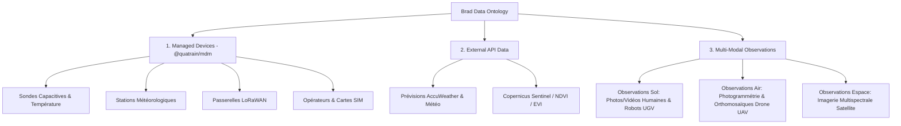

# Spécifications — Ontologie Structurée des Données & Observations Multi-Modales

> 🌐 *English version available in [`DATA_ONTOLOGY_AND_MULTIMODAL.md`](file:///Users/crapougnax/CODE/BRAD2026/bradtech-oss/docs/architecture/DATA_ONTOLOGY_AND_MULTIMODAL.md)*

Ce document définit l'ontologie complète des données pour **bradtech-oss**, la structure atomique des métriques mesurées/calculées (unités, algorithmes référencés, géolocalisation avec altitude, visibilité Open/Closed et URI sémantiques OKF).

---

## 🏛️ 1. Hiérarchie de l'Ontologie des Données



---

## 🔬 2. Modèle Atomique d'une Donnée de Mesure / Calcul (`DataPoint`)

Chaque donnée individuelle au sein du système respecte la structure canonique suivante :

```typescript
export interface DataPoint {
   uid: string // UUID v4
   
   // 1. Origine : Mesurée vs Calculée
   origin: 'measured' | 'computed'
   algorithmCode?: string // Référence à l'algorithme si calculée (ex: 'dewpoint_magnus_v1', 'frost_risk_v2')
   
   // 2. Valeur et Unité
   value: number
   unit?: string // ex: '°C', '%', 'mm', 'W/m²', 'hPa'
   
   // 3. Géolocalisation avec Altitude
   geolocation: {
      latitude: number
      longitude: number
      altitudeMeters: number // Altitude en mètres au-dessus du niveau de la mer
   }
   
   // 4. Visibilité : Open vs Closed
   visibility: 'open' | 'closed'
   
   // 5. Référence URI OKF vers l'élément physique si Open
   // Format: okf:<domain>/<category>/<item>
   // Exemple: okf:mas-baudouin.brad.farm/plots/parcelle-les-erables
   physicalRealityUri?: string
   
   recordedAt: string // Horodatage ISO-8601
}
```

---

## 📐 3. Structure des Entités de l'Ontologie

### A. Équipements Gérés (*Managed Devices*)
- **`Probe`** : Mesures capacitives multi-profondeurs (-10cm, -20cm, -30cm, -40cm), températures du sol, point de rosée calculé (`algorithmCode: 'dewpoint_magnus_v1'`), température au thermomètre mouillé (`algorithmCode: 'wetbulb_stull_v1'`), risque de gel (`algorithmCode: 'frost_risk_faoself_v2'`).
- **`WeatherStation`** : Vitesse/direction du vent, précipitations/pluviométrie, rayonnement solaire, humidité de l'air, pression atmosphérique.
- **`Gateway`** : Statistiques de connexion, RSSI/SNR radio, paquets ingérés, état du pont Basicstation WSS TLS.
- **`SimCard` & `TelcoOperator`** : Inventaire des puces 3G/4G/5G, APN, ICCID, volume de données consommé.

### B. Données Externe Acquises par API (*API-Acquired Data*)
- **`WeatherForecast`** : Prévisions à 5/14 jours par parcelle/réalité (précipitations, températures min/max, ETP Evapotranspiration).
- **`SatelliteDataStream`** : Indices de végétation issus des constellations Sentinel-2 et Landsat (NDVI, NDWI, EVI, LAI) mappés géographiquement sur les polygones des parcelles.

### C. Données d'Observation Multi-Modales (*Multi-Modal Media Assets*)

| Source | Type de Média | Mode de Capture | Métadonnées Structurées & Géolocalisation 3D |
| :--- | :--- | :--- | :--- |
| 🧑 **Humain au sol** | Photo / Vidéo | Smartphone / Tablette PWA | GPS + Altitude, horodatage, orientation compass, tags maladie/ravageurs, URI `okf:mas-baudouin.brad.farm/plots/parcel-1` |
| 🤖 **Robot Sol (UGV)** | Flux Vidéo / RGB / Thermique | Robots d'Élevage ou de Désherbage | Coordonnées 3D (lat, lon, alt), altitude capteur, détection d'objets IA/LiDAR, horodatage haute précision |
| 🛸 **Drone (UAV)** | Orthomosaïque / Multispectral | Survol aérien automatique/manuel | Fichier GeoTIFF, bandes multispectrales (NIR, RedEdge), altimétrie relative, polygones d'emprise |
| 🛰️ **Satellite** | Raster Multispectral | Défilement orbital Sentinel / Planet | Date de passage orbital, couverture nuageuse (%), résolution spatiale (m/px), bandes brutes |

---

## 🗄️ 4. Schéma PostgreSQL Supabase (`@bradtech-oss/db`)

```sql
-- Table des Mesures & Calculs Atomiques
CREATE TABLE public.telemetry_measures (
  uid UUID PRIMARY KEY DEFAULT gen_random_uuid(),
  device_uid UUID REFERENCES public.devices(uid) ON DELETE CASCADE,
  reality_uid UUID REFERENCES public.realities(uid) ON DELETE SET NULL,
  
  -- Origine & Algorithme
  origin TEXT NOT NULL CHECK (origin IN ('measured', 'computed')),
  algorithm_code TEXT, -- ex: 'dewpoint_magnus_v1'
  
  -- Valeur & Unité
  metric_name TEXT NOT NULL,
  numeric_value NUMERIC NOT NULL,
  unit TEXT, -- ex: '°C', '%', 'mm'
  
  -- Géolocalisation 3D avec Altitude
  latitude NUMERIC NOT NULL,
  longitude NUMERIC NOT NULL,
  altitude_meters NUMERIC NOT NULL DEFAULT 0,
  
  -- Visibilité & Référence URI OKF
  visibility TEXT NOT NULL DEFAULT 'closed' CHECK (visibility IN ('open', 'closed')),
  physical_reality_uri TEXT, -- ex: 'okf:mas-baudouin.brad.farm/plots/parcel-42'
  
  recorded_at TIMESTAMP WITH TIME ZONE NOT NULL DEFAULT now()
);

ALTER TABLE public.telemetry_measures ENABLE ROW LEVEL SECURITY;
```
