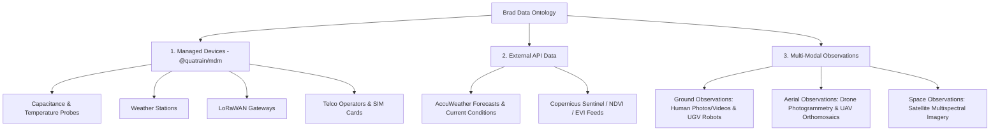

# Specifications — Structured Data Ontology & Multi-Modal Observations

> 🌐 *Version française disponible dans [`DATA_ONTOLOGY_AND_MULTIMODAL.fr.md`](file:///Users/crapougnax/CODE/BRAD2026/bradtech-oss/docs/architecture/DATA_ONTOLOGY_AND_MULTIMODAL.fr.md)*

This document defines the comprehensive data ontology for **bradtech-oss**, detailing the atomic data model for measured vs. computed metrics (units, referenced algorithms, 3D geolocation with altitude, Open/Closed visibility, and OKF physical reality URIs).

---

## 🏛️ 1. Data Ontology Taxonomy Hierarchy



---

## 🔬 2. Atomic DataPoint Specification (`DataPoint`)

Every individual metric datapoint across the ecosystem adheres to the following canonical specification:

```typescript
export interface DataPoint {
   uid: string // UUID v4
   
   // 1. Origin: Measured vs Computed
   origin: 'measured' | 'computed'
   algorithmCode?: string // Referenced algorithm code if computed (e.g. 'dewpoint_magnus_v1', 'frost_risk_v2')
   
   // 2. Value & Unit
   value: number
   unit?: string // e.g. '°C', '%', 'mm', 'W/m²', 'hPa'
   
   // 3. 3D Geolocation with Altitude
   geolocation: {
      latitude: number
      longitude: number
      altitudeMeters: number // Altitude above sea level in meters
   }
   
   // 4. Access Visibility: Open vs Closed
   visibility: 'open' | 'closed'
   
   // 5. OKF Physical Reality URI Reference (if Open)
   // Scheme format: okf:<domain>/<category>/<item>
   // Example: okf:mas-baudouin.brad.farm/plots/parcel-les-erables
   physicalRealityUri?: string
   
   recordedAt: string // ISO-8601 Timestamp
}
```

---

## 📐 3. Ontology Entity Classification

### A. Managed Hardware Devices (`@quatrain/mdm`)
- **`Probe`**: Multi-depth capacitive moisture (-10cm, -20cm, -30cm, -40cm), soil temperatures, computed dewpoint (`algorithmCode: 'dewpoint_magnus_v1'`), wet-bulb temperature (`algorithmCode: 'wetbulb_stull_v1'`), and frost risk assessments (`algorithmCode: 'frost_risk_faoself_v2'`).
- **`WeatherStation`**: Wind speed/direction, precipitation/rainfall rates, solar radiation irradiance, atmospheric humidity, and air pressure.
- **`Gateway`**: Connection health telemetry, radio RSSI/SNR metrics, ingested packet counts, and Basicstation WSS TLS bridge state.
- **`SimCard` & `TelcoOperator`**: 3G/4G/5G SIM card inventory, APN profiles, ICCID, and data consumption tracking.

### B. API-Acquired External Data Feeds
- **`WeatherForecast`**: 5/14-day location-based forecasts per plot/reality (precipitation, min/max temperatures, ETP Evapotranspiration).
- **`SatelliteDataStream`**: Copernicus Sentinel-2 and Landsat vegetation index maps (NDVI, NDWI, EVI, LAI) spatialized over plot geometries.

### C. Multi-Modal Observation Data Assets (*Photos, Videos & Spatial Media*)

| Source | Media Format | Capture Mode | Structured Metadata Payload & 3D Geolocation |
| :--- | :--- | :--- | :--- |
| 🧑 **Ground Human Scout** | Photo / Video | Smartphone / Tablet PWA | GPS + Altitude, timestamp, compass orientation, voice/text notes, disease/pest tags, URI `okf:mas-baudouin.brad.farm/plots/parcel-1` |
| 🤖 **Ground Robot (UGV)** | Video Stream / RGB / Thermal | Livestock or Weeding Robots | 3D coordinates (lat, lon, alt), camera elevation, LiDAR/AI object detection, high-precision timestamp |
| 🛸 **Aerial Drone (UAV)** | Orthomosaic / Multispectral | Automated / Manual UAV flight | GeoTIFF spatial raster, multispectral bands (NIR, RedEdge), relative altimetry, bounding polygon |
| 🛰️ **Space Satellite** | Multispectral Raster | Sentinel / Planet Orbital Pass | Satellite pass timestamp, cloud coverage percentage, spatial resolution (m/px), raw bands |

---

## 🗄️ 4. Supabase PostgreSQL Schema Integration (`@bradtech-oss/db`)

```sql
-- Atomic Telemetry & Computation Measure Table
CREATE TABLE public.telemetry_measures (
  uid UUID PRIMARY KEY DEFAULT gen_random_uuid(),
  device_uid UUID REFERENCES public.devices(uid) ON DELETE CASCADE,
  reality_uid UUID REFERENCES public.realities(uid) ON DELETE SET NULL,
  
  -- Data Origin & Algorithm Reference
  origin TEXT NOT NULL CHECK (origin IN ('measured', 'computed')),
  algorithm_code TEXT, -- e.g. 'dewpoint_magnus_v1'
  
  -- Value & Unit
  metric_name TEXT NOT NULL,
  numeric_value NUMERIC NOT NULL,
  unit TEXT, -- e.g. '°C', '%', 'mm'
  
  -- 3D Geolocation with Altitude
  latitude NUMERIC NOT NULL,
  longitude NUMERIC NOT NULL,
  altitude_meters NUMERIC NOT NULL DEFAULT 0,
  
  -- Visibility & OKF Physical Reality URI Reference
  visibility TEXT NOT NULL DEFAULT 'closed' CHECK (visibility IN ('open', 'closed')),
  physical_reality_uri TEXT, -- e.g. 'okf:mas-baudouin.brad.farm/plots/parcel-42'
  
  recorded_at TIMESTAMP WITH TIME ZONE NOT NULL DEFAULT now()
);

ALTER TABLE public.telemetry_measures ENABLE ROW LEVEL SECURITY;
```
