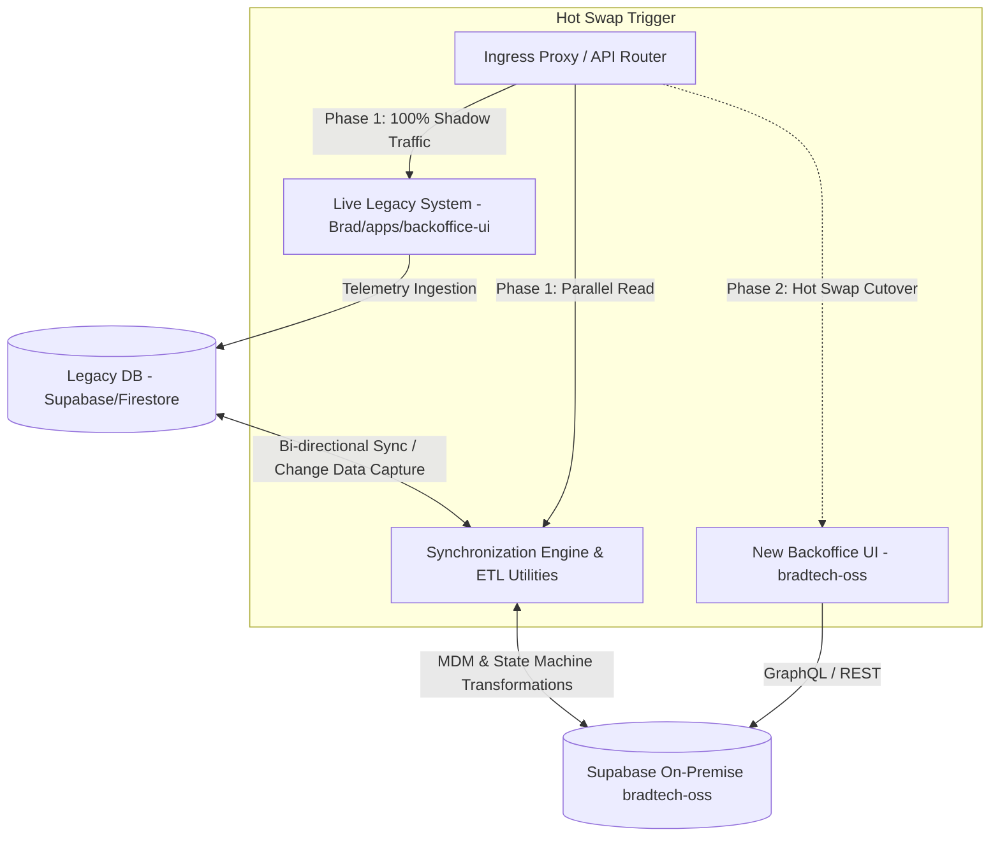

🏠 **[README](../../README.fr.md)** | 🗺️ **[Index Architecture](index.fr.md)** | ⬅️ **[Précédent : Cœur IA Hey Brad](HEY_BRAD_AI_CORE.fr.md)** | ➡️ **[Suivant : LoRaWAN Souverain & CLI Setup](SOVEREIGN_LORAWAN_AND_DEPLOYMENT_CLI.fr.md)**
---

# Spécifications — Synchronisation Bi-Système, Moulinettes ETL & Remplacement à Chaud (*Hot Swap*) (`@bradtech-oss/sync-engine`)

> 🌐 *English version available in [`DATA_SYNC_AND_HOT_SWAP.md`](DATA_SYNC_AND_HOT_SWAP.md)*

Ce document spécifie le moteur de synchronisation bidirectionnelle, les flux de réplication Change Data Capture (CDC), le comparateur de réconciliation et le protocole de basculement sans interruption (*Hot Swap*) entre le système de production hérité **Brad v3** et **bradtech-oss**.

---

## 🔄 1. Schéma d'Architecture Bi-Système

---

## 🛠️ 2. Sous-Systèmes Clés

### A. Moulinette ETL d'Historique (`yarn sync:bulk`)
Convertit les schémas relationnels hérités vers les entités `@quatrain/mdm` et les clés primaires UUID v4 (`uid`).

### B. Flux CDC Temps Réel (`yarn sync:stream`)
Écouteur CDC s'appuyant sur les réplications PostgreSQL Supabase pour répliquer la télémétrie en sous-seconde.

### C. Comparateur de Réconciliation (`yarn sync:reconcile`)
Génère des hachages cryptographiques sur les lignes des tables entre la base héritée et Supabase On-Premise pour garantir l'absence de perte de données.

### D. Protocole de Basculement Sans Interruption (*Hot Swap*)
- **Phase 1 (Shadow Run)** : Brad v3 reste le système maître. `sync-engine` réplique la télémétrie en temps réel vers `bradtech-oss`.
- **Phase 2 (Audit de Parité)** : `yarn sync:reconcile` confirme 100% de parité.
- **Phase 3 (Bascule)** : L'Ingress Proxy fait basculer 100% du trafic vers `bradtech-oss`. La base héritée passe en lecture seule.

---
🏠 **[README](../../README.fr.md)** | 🗺️ **[Index Architecture](index.fr.md)** | ⬅️ **[Précédent : Cœur IA Hey Brad](HEY_BRAD_AI_CORE.fr.md)** | ➡️ **[Suivant : LoRaWAN Souverain & CLI Setup](SOVEREIGN_LORAWAN_AND_DEPLOYMENT_CLI.fr.md)**
