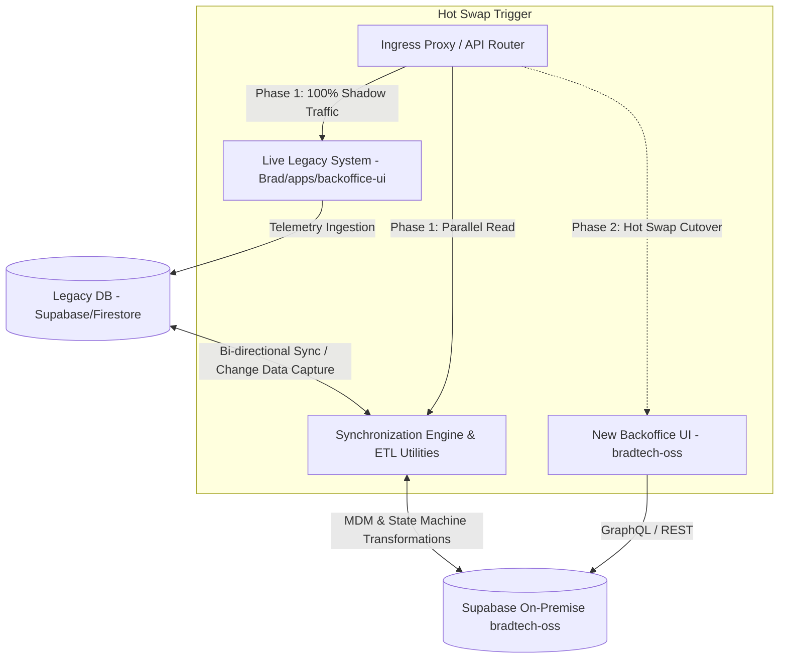

# Specifications — Data Conversion Pipelines, Synchronization & Hot Swap

> 🌐 *Version française disponible dans [`DATA_SYNC_AND_HOT_SWAP.fr.md`](file:///Users/crapougnax/CODE/BRAD2026/bradtech-oss/docs/architecture/DATA_SYNC_AND_HOT_SWAP.fr.md)*

> [!IMPORTANT]
> **Strategic Goal:** Ensure **bradtech-oss** evolves under continuous observation of the live, evolving [`Brad/apps/backoffice-ui`](file:///Users/crapougnax/CODE/BRAD2026/Brad/apps/backoffice-ui) codebase, and provide real-time ETL/synchronization tools allowing a zero-downtime **hot swap** when bradtech-oss reaches full maturity.

---

## 🔄 1. Dual-System Synchronization Architecture

During the transition phase, both systems will run concurrently in parallel:

---

## 🛠️ 2. Conversion Pipelines & ETL Engine

The `@bradtech-oss/sync-engine` package (located in `code/packages/sync-engine`) provides two conversion execution modes:

### A. Bulk Initial Migration Pipeline
- **Purpose**: Migrate and transform all historical records from legacy tables (`probes`, `weather-stations`, `gateways`, `keychains`, `companies`, `plots`, `probe-payloads`) into the unified bradtech-oss schema.
- **Applied Transformations**:
  1. **UUID v4 Mapping**: Convert legacy string IDs into `uid` UUID v4 with alias mapping tables.
  2. **MDM Mapping (`@quatrain/mdm`)**: Convert legacy `probes` and `weather-stations` into enriched `Device` entities with linked components (`PCB`, `Enclosure`, `Sensors`).
  3. **State Machine Mapping (`@quatrain/state-machine`)**: Convert legacy string status fields (`Active`, `Associated`, `Stock`) into strongly typed FSM states (`Available`, `Associated`, `Maintenance`).
  4. **Domain Realities Mapping**: Convert legacy `plots` and `tenancies` into `Realities` (`plot`, `pond`, `barn`, `storage`).

### B. Real-Time Change Data Capture (CDC Mirroring)
- **Purpose**: Replay every new radio frame or device metadata modification from the legacy application into bradtech-oss (and vice-versa).
- **Mechanism**: Supabase PostgreSQL CDC Webhooks and Change Streams feeding the bradtech-oss ingestion queue.

---

## ⚡ 3. Hot-Swap Cutover Strategy

The production cutover follows a strict 3-phase protocol with zero data loss:

| Phase | Description | System Status |
| :--- | :--- | :--- |
| **Phase 1: Shadow Execution** | LoRaWAN uplink frames are ingested by both systems. bradtech-oss computes FSM states and metrics in background without affecting prod. | **Primary:** Legacy **Secondary:** bradtech-oss (Shadow) |
| **Phase 2: Dual Read & Verification** | Operators can access both Backoffices. Automated reconciliation checkers verify 100% strict data parity. | **Primary:** Legacy **Secondary:** bradtech-oss (Read-Only Prod) |
| **Phase 3: Hot Swap Cutover** | Ingress/DNS route (`backoffice.brad.technology`) is redirected to bradtech-oss. The legacy system switches to read-only archive mode. | **Primary:** bradtech-oss **Archive:** Legacy |
