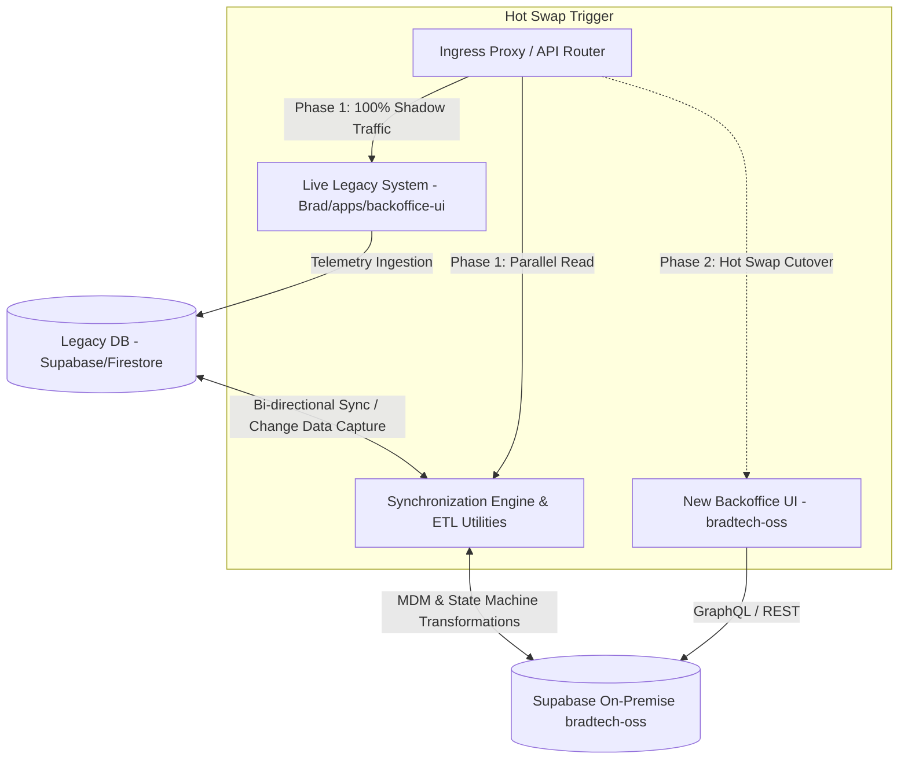

🏠 **[README](../../README.md)** | 🗺️ **[Architecture Index](index.md)** | ⬅️ **[Previous: Hey Brad AI Core](HEY_BRAD_AI_CORE.md)** | ➡️ **[Next: Sovereign LoRaWAN & CLI Setup](SOVEREIGN_LORAWAN_AND_DEPLOYMENT_CLI.md)**
---

# Specifications — Bi-System Synchronization, ETL Migration & Zero-Downtime Hot Swap (`@bradtech-oss/sync-engine`)

> 🌐 *Version française disponible dans [`DATA_SYNC_AND_HOT_SWAP.fr.md`](DATA_SYNC_AND_HOT_SWAP.fr.md)*

This document specifies the bidirectional ETL migration utilities, Change Data Capture (CDC) replication streams, reconciliation verifier tools, and zero-downtime hot-swap protocol between the legacy **Brad v3** production stack (`Brad/apps/backoffice-ui`) and **bradtech-oss**.

---

## 🔄 1. Dual-System Architecture Diagram

---

## 🛠️ 2. Core Subsystems

### A. Bulk Historical Migration ETL (`yarn sync:bulk`)
Converts legacy relational schemas into `@quatrain/mdm` entities and UUID v4 (`uid`) primary keys.

### B. Real-Time Change Data Capture Stream (`yarn sync:stream`)
Real-time CDC listener listening to Supabase PostgreSQL replication slots to sync telemetry data in sub-second latency.

### C. 100% Data Parity Reconciliation Verifier (`yarn sync:reconcile`)
Runs automated cryptographic hashing across corresponding table rows between legacy DB and Supabase On-Premise to guarantee zero data loss.

### D. Zero-Downtime Hot Swap Cutover Protocol
- **Phase 1 (Shadow Running)**: Legacy Brad v3 runs as primary. `sync-engine` replicates telemetry to `bradtech-oss` in real time.
- **Phase 2 (Parity Audit)**: `yarn sync:reconcile` confirms 100% match.
- **Phase 3 (Hot Cutover)**: Ingress proxy shifts 100% traffic to `bradtech-oss`. Legacy DB becomes a read-only archive replica.

---
🏠 **[README](../../README.md)** | 🗺️ **[Architecture Index](index.md)** | ⬅️ **[Previous: Hey Brad AI Core](HEY_BRAD_AI_CORE.md)** | ➡️ **[Next: Sovereign LoRaWAN & CLI Setup](SOVEREIGN_LORAWAN_AND_DEPLOYMENT_CLI.md)**
