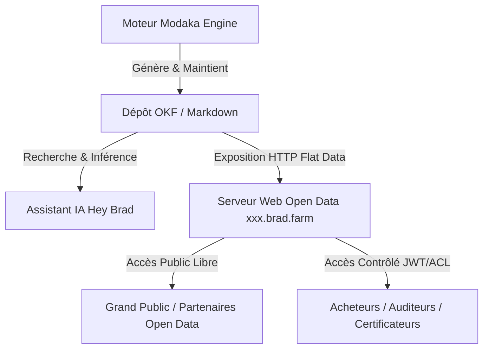

# Spécifications — Cœur IA "Hey Brad" (Moteur Modaka & Repositories OKF)

> 🌐 *English version available in [`HEY_BRAD_AI_CORE.md`](file:///Users/crapougnax/CODE/BRAD2026/bradtech-oss/docs/architecture/HEY_BRAD_AI_CORE.md)*

Ce document décrit l'intégration du moteur IA **Modaka** au cœur de l'application **bradtech-oss**, basé sur le format ouvert **OKF (Open Knowledge Format v0.1)** et la publication des données ouvertes des exploitations sur des sous-domaines dédiés `xxx.brad.farm`.

---

## 🤖 1. Modaka & le Format OKF (Open Knowledge Format)

Contrairement aux architectures RAG vectorielles fermées traditionnelles, **Hey Brad** repose sur le moteur **Modaka**, qui construit, maintient et met à jour en continu un **répertoire de connaissances structuré au format OKF (Open Knowledge Format v0.1)**.

### Principes Directeurs OKF v0.1 :
- **Documents Markdown à Plat avec En-tête YAML** : Chaque concept (culture, parcelle, guide agronomique, synthèse de capteur) est un document Markdown autonome.
- **Noms Sémantiques** : Fichiers lisibles par des humains et des agents IA (`okf-the-markdown-spec-for-humans-and-ai-agents.md`), sans UUIDs opaques dans l'arborescence des fichiers.
- **Indexation Progressive (Index-First)** : Navigation fluide via des fichiers d'indexation (`index.md`) et liens Markdown relatifs.

```text
content/
├── index.md                        # Index racine des connaissances
├── agronomy/
│   ├── index.md                    # Index de la catégorie agronomie
│   └── irrigation-guides/
│       └── water-stress-management.md
└── telemetry-summaries/
    ├── index.md                    # Syntheses capteurs générées par Modaka
    └── plot-les-erables-2026.md
```

---

## 🌐 2. Publication Open Data par Exploitation (`xxx.brad.farm`)

Chaque client / exploitation dispose d'un point d'accès HTTP personnalisé sur un sous-domaine dédié : **`https://<tenant>.brad.farm`** (ex: `https://chateau-margaux.brad.farm` ou `https://ferme-avignon.brad.farm`).



### Modes d'Exposition des Données :
1. **Accès Open Data (Public)** : L'exploitant choisit d'exposer à plat tout ou partie de ses données environnementales, bilans d'irrigation et diagnostics bas carbone à la communauté.
2. **Accès Contrôlé (Restreint / ACL)** : Contrôle d'accès fin par jetons d'API/JWT pour partager des sous-dossiers OKF spécifiques avec des acheteurs, coopératives ou organismes de certification.

---

## 🧠 3. Navigation & Traitement IA par Modaka

Le moteur **Modaka** parcourt le répertoire OKF de manière progressive :
1. **Lecture des fichiers d'index (`index.md`)** pour identifier la structure des domaines.
2. **Résolution des liens sémantiques Markdown** pour agréger le contexte complet.
3. **Mise à jour en temps réel des documents OKF** lors de la réception de nouvelles télémétries ou analyses agronomiques.
