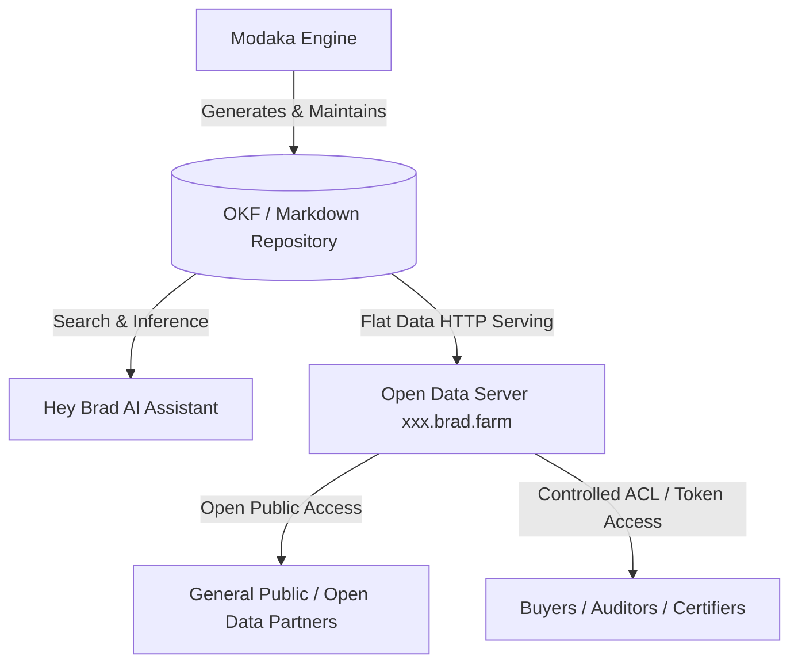

# Spécifications — Cœur IA "Hey Brad" & Repositories OKF Modaka (`@bradtech-oss/hey-brad`)

> 🌐 *English version available in [`HEY_BRAD_AI_CORE.md`](HEY_BRAD_AI_CORE.md)*

Ce document spécifie l'intégration du **Moteur Modaka**, du format **Open Knowledge Format (OKF v0.1)** et de l'exposition Open Data par tenant (`https://<tenant>.brad.farm`).

---

## 🤖 1. Architecture Modaka & Format OKF v0.1

Au lieu d'une base vectorielle propriétaire opaque, **Hey Brad** s'appuie sur le **Moteur Modaka**, qui construit et maintient un dépôt Markdown structuré au format **Open Knowledge Format (OKF v0.1)**.

### Structure d'un Document OKF v0.1 :
- **Nom du fichier** : Slugifié (ex: `conduite-irrigation-parcelle-42.md`).
- **En-tête YAML plat** : Délimité par `---`.
- **Attributs Obligatoires** :
  - `type` : `specification` | `guide` | `observation` | `recipe`
  - `title` : Titre lisible
  - `description` : Résumé en 1-2 phrases
  - `tags` : Tableau de chaînes en minuscules
  - `timestamp` : Horodatage ISO
- **Corps Markdown** : Texte Markdown GFM standard avec liens relatifs.

---

## 🌐 2. Point d'Accès Open Data par Tenant (`xxx.brad.farm`)

Chaque client/tenant dispose d'un sous-domaine dédié :
`https://<tenant>.brad.farm` (ex: `chateau-margaux.brad.farm` ou `mas-baudouin.brad.farm`).

### Modes d'Accès :
1. **Open Data (Accès Libre)** : Données publiques accessibles directement sans authentification.
2. **Accès Contrôlé (ACL)** : Authentification par jeton Bearer ou JWT pour les données parcellaires privées.

---
🏠 **[README](../../README.fr.md)** | 🗺️ **[Index Architecture](index.fr.md)** | ⬅️ **[Précédent : Schéma Supabase On-Premise](SUPABASE_ONPREM_SCHEMA.fr.md)** | ➡️ **[Suivant : Sync ETL & Remplacement à Chaud](DATA_SYNC_AND_HOT_SWAP.fr.md)**
