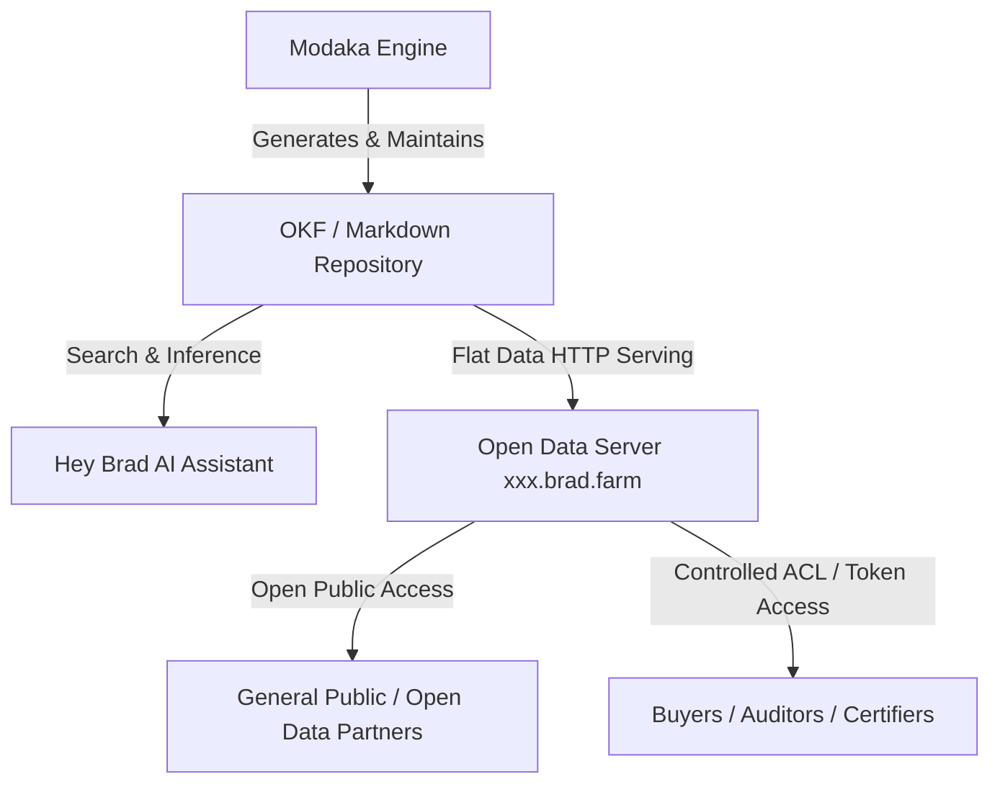

# Specifications — "Hey Brad" AI Core (Modaka Engine & OKF Repositories)

> 🌐 *Version française disponible dans [`HEY_BRAD_AI_CORE.fr.md`](file:///Users/crapougnax/CODE/BRAD2026/bradtech-oss/docs/architecture/HEY_BRAD_AI_CORE.fr.md)*

This document describes the integration of the **Modaka AI engine** into the core of **bradtech-oss**, based on the **Open Knowledge Format (OKF v0.1)** specification and flat Open Data publishing on dedicated `xxx.brad.farm` tenant endpoints.

---

## 🤖 1. Modaka Engine & Open Knowledge Format (OKF v0.1)

Unlike traditional closed vector database RAG architectures, **Hey Brad** is built directly on the **Modaka Engine**, which constructs, maintains, and continuously updates a **structured knowledge repository in the OKF v0.1 specification**.

### OKF v0.1 Core Principles:
- **Flat Markdown Documents with YAML Headers**: Each concept (crop, plot, agronomic guide, sensor summary) is a standalone Markdown document with flat YAML frontmatter.
- **Semantic File Names**: Human and AI-readable slugified filenames (`water-stress-management.md`), avoiding opaque UUIDs in the document filesystem.
- **Progressive Index-First Disclosure**: Seamless navigation starting from category index files (`index.md`) following relative Markdown links.

```text
content/
├── index.md                        # Root Knowledge Index
├── agronomy/
│   ├── index.md                    # Agronomy Category Index
│   └── irrigation-guides/
│       └── water-stress-management.md
└── telemetry-summaries/
    ├── index.md                    # Modaka-generated Sensor Summaries
    └── plot-les-erables-2026.md
```

---

## 🌐 2. Per-Tenant Open Data Publishing (`xxx.brad.farm`)

Every client / farm site is assigned a dedicated HTTP endpoint: **`https://<tenant>.brad.farm`** (e.g., `https://chateau-margaux.brad.farm` or `https://avignon-farm.brad.farm`).



### Data Exposure Modes:
1. **Open Data Access (Public)**: Farm operators can choose to publicly expose all or part of their environmental metrics, irrigation balances, and low-carbon diagnostics to the community.
2. **Controlled Access (Restricted / ACL)**: Fine-grained access control using API tokens/JWTs to share specific OKF subfolders with buyers, cooperatives, or certification bodies.

---

## 🧠 3. AI Navigation & Processing by Modaka

The **Modaka engine** traverses the OKF repository using progressive disclosure:
1. **Reads Index Files (`index.md`)** to map out category structures and available concepts.
2. **Resolves Relative Markdown Links** to aggregate complete context on demand.
3. **Continuously Updates OKF Documents** as new telemetry or agronomic analysis data arrives.
