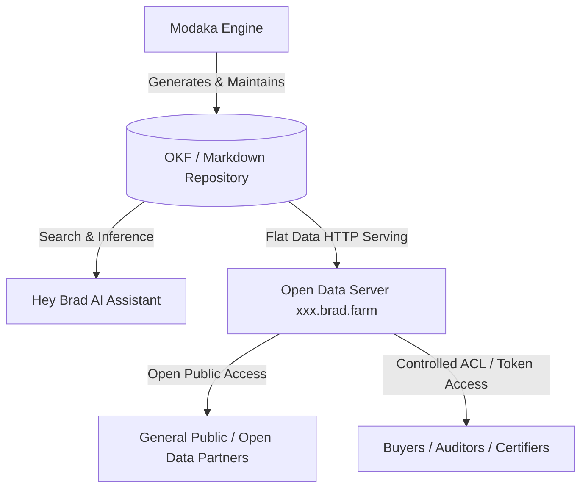

# Specifications — "Hey Brad" AI Core Engine & Modaka OKF Repository (`@bradtech-oss/hey-brad`)

> 🌐 *Version française disponible dans [`HEY_BRAD_AI_CORE.fr.md`](HEY_BRAD_AI_CORE.fr.md)*

This document specifies the integration of the **Modaka Engine**, the **Open Knowledge Format (OKF v0.1)** Markdown specifications, and the tenant Open Data HTTP serving mechanism (`https://<tenant>.brad.farm`).

---

## 🤖 1. Modaka Architecture & OKF v0.1 Integration

Instead of a black-box vector database, **Hey Brad** relies on the **Modaka Engine**, which constructs and maintains a flat, human & AI-readable **Open Knowledge Format (OKF v0.1)** Markdown repository.

### OKF v0.1 Document Structure:
- **Slugified Filename**: `my-concept-title.md`
- **Flat YAML Frontmatter**: Bounded by `---`.
- **Mandatory Frontmatter Attributes**:
  - `type`: `specification` | `guide` | `observation` | `recipe`
  - `title`: Human title
  - `description`: 1-2 sentence summary
  - `tags`: Array of lowercase tag strings
  - `timestamp`: Creation ISO timestamp
- **Markdown Body**: Standard GFM Markdown with relative cross-links.

---

## 🌐 2. Per-Tenant Open Data Endpoint (`xxx.brad.farm`)

Each client/tenant receives a dedicated HTTP sub-domain endpoint:
`https://<tenant>.brad.farm` (e.g. `chateau-margaux.brad.farm` or `mas-baudouin.brad.farm`).

### Access Modes:
1. **Open Data (Public)**: Flat Markdown/JSON files accessible publicly without authentication.
2. **Controlled Access (ACL)**: Bearer token or JWT authentication required for private plot data or sensitive financial/yield metrics.

---
🏠 **[README](../../README.md)** | 🗺️ **[Architecture Index](index.md)** | ⬅️ **[Previous: Supabase On-Premise Schema](SUPABASE_ONPREM_SCHEMA.md)** | ➡️ **[Next: Dual-System ETL & Hot Swap](DATA_SYNC_AND_HOT_SWAP.md)**
