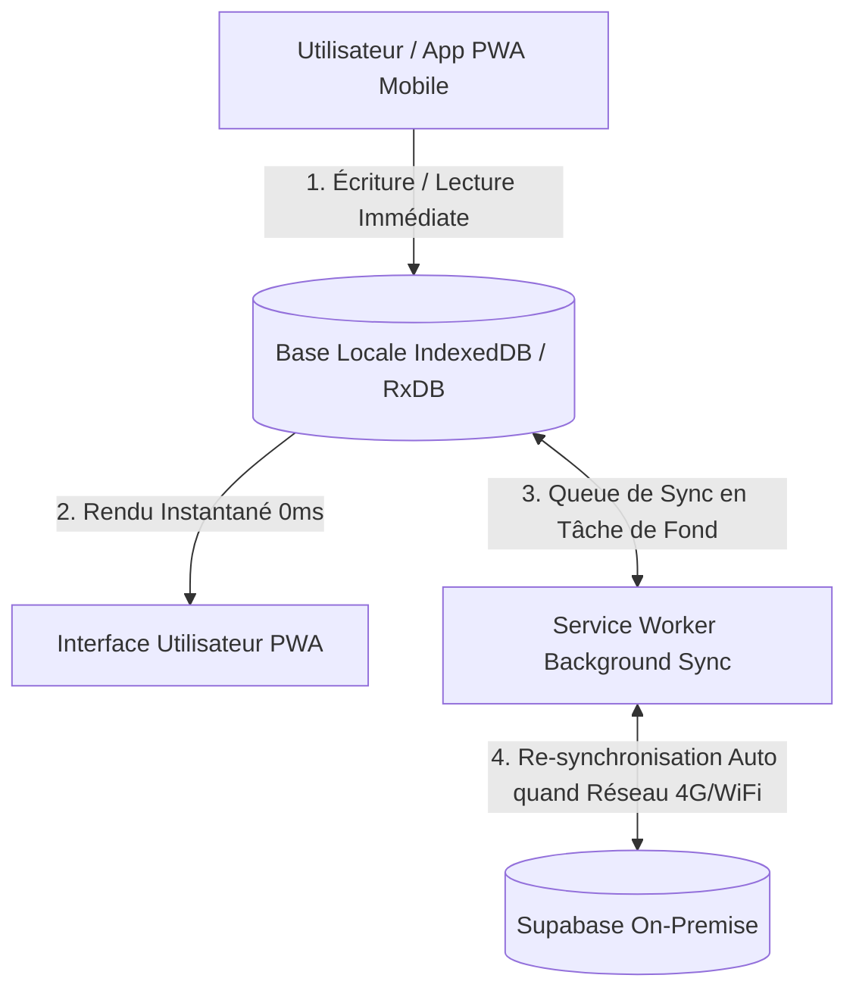

🏠 **[README](../../README.fr.md)** | 🗺️ **[Index Architecture](index.fr.md)** | ⬅️ **[Précédent : Side Roadmap & UX PWA](SIDE_ROADMAP_AND_UX.fr.md)** | ➡️ **[Suivant : Ontologie Données & Multi-Modal](DATA_ONTOLOGY_AND_MULTIMODAL.fr.md)**
---

# Spécifications — Architecture Local-First, Quality Gates SonarQube & Outillage CI/CD

> 🌐 *English version available in [`LOCAL_FIRST_AND_QUALITY_GATES.md`](LOCAL_FIRST_AND_QUALITY_GATES.md)*

Ce document détaille les piliers d'architecture **Local-First** au cœur des applications PWA, l'intégration des barrières de qualité **SonarQube**, le simulateur de télémétrie local et le pipeline de déploiement continu **GitHub Actions**.

---

## 📱 1. Architecture Local-First (Cœur des Applications PWA)

L'approche **Local-First** est placée au centre du design des applications `apps/mobile` et `apps/backoffice`. Elle garantit qu'un utilisateur ou technicien sur le terrain peut travailler sans aucune interruption, même en l'absence totale de réseau cellulaires 4G/5G.



### Principes Directeurs Local-First :
1. **Source de Vérité Locale** : Toute modification (prise de photo, observation terrain, changement d'état d'automate `@quatrain/state-machine`) est écrite immédiatement dans la base locale **IndexedDB**.
2. **Réactivité Instantanée (0ms)** : L'interface PWA se met à jour immédiatement sans attendre la réponse du serveur distant.
3. **File de Synchronisation Résiliente (*Conflict-Free Replicated Data*)** : Le Service Worker gère les réessais automatiques et la résolution des conflits lors du retour de la connectivité avec l'instance Supabase On-Premise.

---

## 🛡️ 2. Gates de Qualité SonarQube & CI/CD GitHub Actions

Afin de garantir un code d'une qualité irréprochable et maintenable sur un horizon de 15 ans, le monorepo intègre une configuration **SonarQube** stricte (`sonar-project.properties`) intégrée au workflow GitHub Actions (`.github/workflows/ci.yml`).

### Exigences des Quality Gates SonarQube :
- 🟢 **Couverture de Tests Unitaires** : Minimum 80% de couverture sur tous les paquets `@quatrain/*` et `@bradtech-oss/*`.
- 🛡️ **Vulnerabilités & Sécurité** : 0 faille de sécurité (Zero Security Hotspots / CVEs).
- 🧹 **Duplication de Code** : Moins de 3% de duplication globale.
- 💬 **Anglais International Stricte** : Contrôle de la langue des commentaires, symboles et logs.

### Exemple de configuration `.github/workflows/ci.yml` :
```yaml
name: CI & SonarQube Quality Gate

on:
  push:
    branches: [main]
  pull_request:

jobs:
  quality-gate:
    runs-on: ubuntu-latest
    steps:
      - uses: actions/checkout@v4
        with:
          fetch-depth: 0
      - uses: oven/sh-setup-bun@v1
      - name: Install dependencies
        run: bun install --frozen-lockfile
      - name: Run Unit Tests & Coverage
        run: bun run test --coverage
      - name: SonarQube Scan
        uses: SonarSource/sonarqube-scan-action@v2
        env:
          SONAR_TOKEN: ${{ secrets.SONAR_TOKEN }}
          SONAR_HOST_URL: ${{ secrets.SONAR_HOST_URL }}
```

---

## 🧪 3. Simulateur de Télémétrie Local (`@bradtech-oss/mock-simulator`)

Pour permettre le développement hors-ligne et la validation des automates à états sans équipement physique connecté :

```bash
cd "/Users/crapougnax/CODE/BRAD2026/bradtech-oss"

# Lancement du générateur de trames radio simulées
yarn mock:telemetry --interval 5s --probes 10 --stations 2
```

### Fonctionnalités du Simulateur :
- Génération aléatoire réaliste de valeurs capacitives (humidité du sol), températures, pluie et vent.
- Déclenchement de scénarios d'alerte (ex: simulation de gel brutal ou de sécheresse critique) pour valider l'exécution des automates `@quatrain/state-machine` et les mises à jour des repositories **OKF**.

---
🏠 **[README](../../README.fr.md)** | 🗺️ **[Index Architecture](index.fr.md)** | ⬅️ **[Précédent : Side Roadmap & UX PWA](SIDE_ROADMAP_AND_UX.fr.md)** | ➡️ **[Suivant : Ontologie Données & Multi-Modal](DATA_ONTOLOGY_AND_MULTIMODAL.fr.md)**
