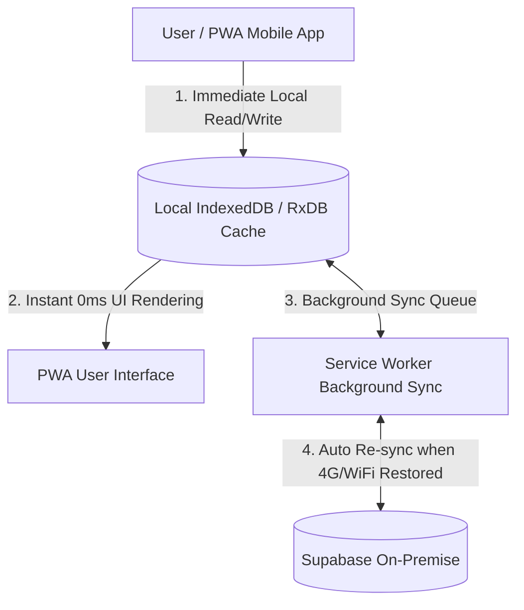

🏠 **[README](../../README.md)** | 🗺️ **[Architecture Index](index.md)** | ⬅️ **[Previous: Side Roadmap & PWA UX](SIDE_ROADMAP_AND_UX.md)** | ➡️ **[Next: Data Ontology & Multi-Modal](DATA_ONTOLOGY_AND_MULTIMODAL.md)**
---

# Specifications — Local-First Architecture, SonarQube Quality Gates & CI/CD Tooling

> 🌐 *Version française disponible dans [`LOCAL_FIRST_AND_QUALITY_GATES.fr.md`](LOCAL_FIRST_AND_QUALITY_GATES.fr.md)*

This document details the core **Local-First** architectural principles driving the PWA applications, the integration of **SonarQube Quality Gates**, the local telemetry simulation suite, and the **GitHub Actions** continuous integration workflow.

---

## 📱 1. Local-First Architecture (Heart of PWA Applications)

The **Local-First** approach is placed at the absolute center of `code/apps/mobile` and `code/apps/backoffice`. It guarantees that any technician or field operator can work seamlessly without disruption, even in complete 4G/5G cellular dead zones.



### Core Local-First Principles:
1. **Local Source of Truth**: All mutations (taking photos, ground observation notes, `@quatrain/state-machine` state transitions) are written immediately to local **IndexedDB**.
2. **Instant 0ms Responsiveness**: The PWA user interface updates immediately without awaiting remote server network round-trips.
3. **Resilient Synchronization Queue (*Conflict-Free Replicated Data*)**: The Service Worker manages automated retries and conflict resolution when connectivity with the On-Premise Supabase instance is re-established.

---

## 🛡️ 2. SonarQube Quality Gates & GitHub Actions CI/CD

To guarantee code maintainability over a 15-year horizon, the monorepo enforces strict **SonarQube Quality Gates** (`sonar-project.properties`) integrated into the GitHub Actions workflow (`.github/workflows/ci.yml`).

### SonarQube Quality Gate Metrics:
- 🟢 **Unit Test Coverage**: Minimum 80% line coverage across all `@quatrain/*` and `@bradtech-oss/*` packages.
- 🛡️ **Vulnerabilities & Security**: Zero security vulnerabilities (Zero Security Hotspots / CVEs).
- 🧹 **Code Duplication**: Under 3% global code duplication.
- 💬 **Strict International English**: Automated linting enforcing English comments, symbols, and log messages.

### Example `.github/workflows/ci.yml` Workflow:
```yaml
name: CI & SonarQube Quality Gate

on:
  push:
    branches: [main]
  pull_request:

jobs:
  quality-gate:
    runs-on: ubuntu-latest
    steps:
      - uses: actions/checkout@v4
        with:
          fetch-depth: 0
      - uses: oven/sh-setup-bun@v1
      - name: Install dependencies
        run: bun install --frozen-lockfile
      - name: Run Unit Tests & Coverage
        run: bun run test --coverage
      - name: SonarQube Scan
        uses: SonarSource/sonarqube-scan-action@v2
        env:
          SONAR_TOKEN: ${{ secrets.SONAR_TOKEN }}
          SONAR_HOST_URL: ${{ secrets.SONAR_HOST_URL }}
```

---

## 🧪 3. Local Telemetry Simulator (`@bradtech-oss/mock-simulator`)

To enable offline development and state machine validation without live hardware devices connected:

```bash
cd "/Users/crapougnax/CODE/BRAD2026/bradtech-oss"

# Run simulated radio telemetry frame generator
yarn mock:telemetry --interval 5s --probes 10 --stations 2
```

### Simulator Capabilities:
- Realistic random data generation for soil moisture capacitance, temperatures, rainfall, and wind speed.
- Alert scenario triggers (e.g., simulating sudden frost or severe drought) to validate `@quatrain/state-machine` execution and **OKF** repository updates.

---
🏠 **[README](../../README.md)** | 🗺️ **[Architecture Index](index.md)** | ⬅️ **[Previous: Side Roadmap & PWA UX](SIDE_ROADMAP_AND_UX.md)** | ➡️ **[Next: Data Ontology & Multi-Modal](DATA_ONTOLOGY_AND_MULTIMODAL.md)**
