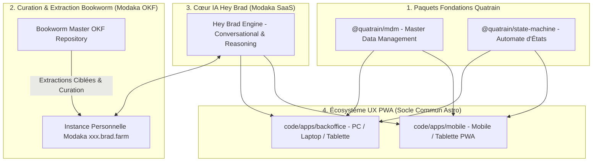

🏠 **[README](../../README.fr.md)** | 🗺️ **[Index Architecture](index.fr.md)** | ⬅️ **[Précédent : Planning Août 2026](AUGUST_2026_SPRINT_ROADMAP.fr.md)** | ➡️ **[Suivant : Architecture Local-First & Quality Gates](LOCAL_FIRST_AND_QUALITY_GATES.fr.md)**
---

# Spécifications — Side Roadmap : Paquets Quatrain, Curation Bookworm, Cœur Hey Brad & Écosystème UX PWA

> 🌐 *English version available in [`SIDE_ROADMAP_AND_UX.md`](SIDE_ROADMAP_AND_UX.md)*

Ce document détaille la **Side Roadmap** transversale pour le développement des briques fondations Quatrain, le système de curation Bookworm OKF, le moteur IA Hey Brad (Modaka SaaS) et la refonte des applications UX PWA (Backoffice & Mobile).

---

## 🗺️ 1. Vue d'Ensemble de la Side Roadmap

---

## 🎯 2. Détail des Axes de la Side Roadmap

### Axe 1 : Paquets Fondations Écosystème Quatrain (`@quatrain/*`)
- **`@quatrain/mdm`** : Socle Master Data Management fournissant les abstractions typées pour `Device`, `Sensor`, `Component` et `Reality`.
- **`@quatrain/state-machine`** : Moteur d'automate à états finis (FSM) réactif régissant les transitions d'équipements et de réalités (*Parcelles, Élevages, Bassins, Silos*).

### Axe 2 : Curation & Extraction Bookworm OKF (Moteur Modaka)
- **Curation Master OKF** : Maintenance du corpus de connaissances agronomiques, zootechniques et d'irrigation au format **OKF v0.1**.
- **Extraction Fine & Initialisation** : Moulinette permettant d'extraire des sous-ensembles de documents OKF personnalisés pour initialiser l'instance personnelle Modaka d'une exploitation (`https://<tenant>.brad.farm`).

### Axe 3 : Cœur IA Hey Brad (Modaka SaaS)
- Intégration du moteur d'assistance conversationnelle et d'inférence dérivé de **Modaka SaaS**.
- Capacité d'exécuter des requêtes croisées entre le repository OKF local et les flux de télémétrie en temps réel.

### Axe 4 : Expérience Utilisateur Hybride (Data + Carto + Conversational)
- Composants UX permettant d'intercaler et de composer librement au sein d'une même vue :
  - **Briques de Données** (cartes KPI, métriques temps réel).
  - **Représentations Cartographiques** (cartes SIG interactives, polygones de parcelles).
  - **Threads Conversationnels IA** (interface de dialogue directe avec Hey Brad).

### Axe 5 : Séparation Claire Backoffice & Mobile App (Astro PWA)
- **`code/apps/backoffice`** : Interface d'administration et d'analyse avancée, responsive et optimisée pour **PC de bureau, Laptops et Tablettes**.
- **`code/apps/mobile`** : Application terrain autonome PWA (Progressive Web App), épurée et optimisée pour **Smartphones et Tablettes**.
- **Socle Commun** : Partage à 100% des paquets `@quatrain/mdm`, `@quatrain/state-machine` et du design system Quatrain CoreUX.

---
🏠 **[README](../../README.fr.md)** | 🗺️ **[Index Architecture](index.fr.md)** | ⬅️ **[Précédent : Planning Août 2026](AUGUST_2026_SPRINT_ROADMAP.fr.md)** | ➡️ **[Suivant : Architecture Local-First & Quality Gates](LOCAL_FIRST_AND_QUALITY_GATES.fr.md)**
