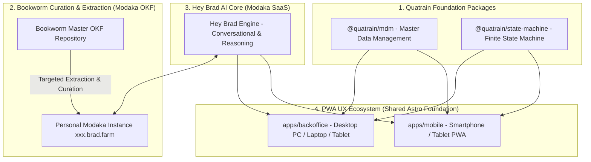

🏠 **[README](../../README.md)** | 🗺️ **[Architecture Index](index.md)** | ⬅️ **[Previous: August 2026 Sprint Roadmap](AUGUST_2026_SPRINT_ROADMAP.md)** | ➡️ **[Next: Local-First & Quality Gates](LOCAL_FIRST_AND_QUALITY_GATES.md)**
---

# Specifications — Side Roadmap: Quatrain Core Packages, Bookworm Curation, Hey Brad & PWA UX Ecosystem

> 🌐 *Version française disponible dans [`SIDE_ROADMAP_AND_UX.fr.md`](SIDE_ROADMAP_AND_UX.fr.md)*

This document details the cross-cutting **Side Roadmap** for developing Quatrain foundation packages, the Bookworm OKF content curation system, the Hey Brad AI engine (Modaka SaaS), and the PWA application split (Backoffice & Mobile Apps).

---

## 🗺️ 1. Side Roadmap System Overview

---

## 🎯 2. Side Roadmap Core Pillars

### Pillar 1: Quatrain Ecosystem Foundation Packages (`@quatrain/*`)
- **`@quatrain/mdm`**: Master Data Management foundation providing typed abstract definitions for `Device`, `Sensor`, `Component`, and `Reality`.
- **`@quatrain/state-machine`**: Reactive Finite State Machine (FSM) engine governing lifecycle transitions for hardware devices and physical realities (*Plots, Barns, Ponds, Silos*).

### Pillar 2: Bookworm OKF Curation & Sliced Content Extraction (Modaka Engine)
- **Master OKF Curation**: Maintaining the agronomic, livestock husbandry, and irrigation knowledge base in **OKF v0.1** specification.
- **Targeted Slicing & Initialization**: Extraction tools to slice specific OKF document subsets to initialize a tenant's personal Modaka instance (`https://<tenant>.brad.farm`).

### Pillar 3: Hey Brad AI Core (Modaka SaaS)
- Integrating the conversational assistance and inference engine derived from **Modaka SaaS**.
- Ability to execute cross-domain queries between the tenant's local OKF repository and real-time sensor telemetry.

### Pillar 4: Hybrid User Experience (Data + Cartography + Conversational Threads)
- Modular UX components allowing seamless composition within single unified views:
  - **Data Blocks** (KPI cards, real-time metrics).
  - **Cartographic Views** (interactive GIS maps, plot polygons).
  - **AI Conversational Threads** (direct chat dialog with Hey Brad).

### Pillar 5: Clean Separation of Backoffice & Mobile PWA Apps (Astro)
- **`apps/backoffice`**: Comprehensive administration and analytics dashboard, responsive and optimized for **Desktop PCs, Laptops, and Tablets**.
- **`apps/mobile`**: Standalone PWA (Progressive Web App) field application, streamlined and optimized for **Smartphones and Tablets**.
- **Shared Foundation**: 100% shared `@quatrain/mdm`, `@quatrain/state-machine`, and Quatrain CoreUX design system.

---
🏠 **[README](../../README.md)** | 🗺️ **[Architecture Index](index.md)** | ⬅️ **[Previous: August 2026 Sprint Roadmap](AUGUST_2026_SPRINT_ROADMAP.md)** | ➡️ **[Next: Local-First & Quality Gates](LOCAL_FIRST_AND_QUALITY_GATES.md)**
