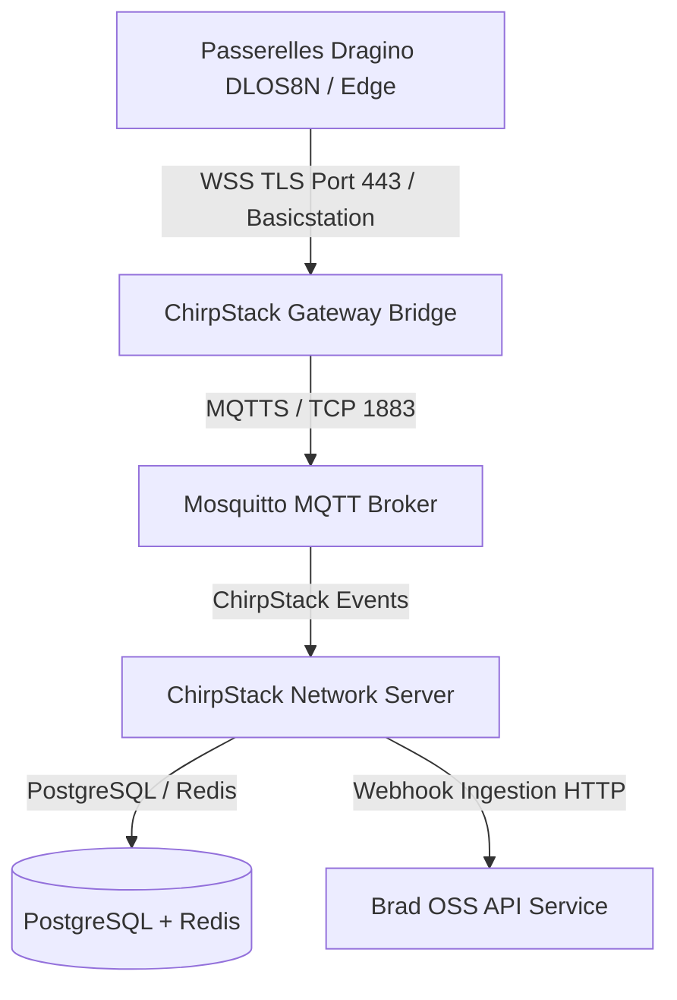

# Spécifications — Infrastructure LoRaWAN Souveraine & Outil de Génération de Déploiement CLI

> 🌐 *English version available in [`SOVEREIGN_LORAWAN_AND_DEPLOYMENT_CLI.md`](file:///Users/crapougnax/CODE/BRAD2026/bradtech-oss/docs/architecture/SOVEREIGN_LORAWAN_AND_DEPLOYMENT_CLI.md)*

> [!NOTE]
> **Souveraineté des Données & Provisioning Sécurisé :** Intégration complète d'un serveur LoRaWAN souverain embarqué (*ChirpStack + Gateway Bridge WSS + Mosquitto*) et d'un outil CLI de génération automatique de configurations et clés secrètes sur-mesure pour chaque site d'installation.

---

## 🛰️ 1. Infrastructure LoRaWAN Souveraine Embarquée (`infra/lorawan-server`)

Issue du projet [`bradtech/lorawan-server`](file:///Users/crapougnax/CODE/BRAD2026/lorawan-server), cette brique assure la souveraineté totale du traitement des trames LoRaWAN directement On-Premise.



### Composants Embarqués
1. **ChirpStack v4 Network Server** : Gestion souveraine des associations OTAA, sessions radio et déduplication.
2. **ChirpStack Gateway Bridge (Basicstation WSS)** : Ingestion sécurisée en WebSocket TLS (`wss://`) avec filtrage au bord des préfixes OUI IEEE.
3. **Broker MQTT Mosquitto** : Bus de messages interne isolé.
4. **Base PostgreSQL & Cache Redis dédiés** : Stockage souverain des clés d'équipements et sessions.

---

## 🛠️ 2. Outil CLI de Configuration & Génération de Clés Secrètes (`infra/tools/setup-cli`)

Afin de garantir un déploiement sécurisé, personnalisable et instantané sur chaque nouveau site d'exploitation, l'outil CLI `@bradtech-oss/cli-setup` (exécutable via `yarn setup` ou `podman run`) prend en charge :

### A. Génération Automatique des Clés Secrètes Cryptographiques
- Mots de passe PostgreSQL isolés et aléatoires (32+ caractères).
- Clés secrètes JWT pour Supabase et ChirpStack API.
- Génération automatique des certificats SSL/TLS autosignés ou Let's Encrypt (ISRG Root X1).
- Paires de clés API et identifiants MQTT.

### B. Personnalisation Propre à Chaque Installation
L'outil interactif demande ou injecte les paramètres spécifiques au site :
- **Nom de domaine public/privé** (ex: `lorawan.ferme-exemple.fr`).
- **Préfixes OUI / JoinEUI filtrés** (ex: `8C:1F:64`).
- **Région du spectre radio** (ex: `EU868`, `US915`).
- **Identifiants des passerelles et SIM 3G/4G (APN, PIN, PUK, IMEI)**.

### C. Artefacts de Sortie Générés
Une fois exécuté, l'outil génère automatiquement le pack d'installation complet :
- `.env` et `.env.secrets` cryptés pour le site.
- `infra/podman/podman-compose.site.yml` prêt à l'emploi.
- `infra/helm/values-site.yaml` sur-mesure pour Helm / K8s.
- `dlos8n-config-site.tar.gz` : Archive de configuration Dragino à injecter directement dans le menu de restauration des passerelles du site !

---

## 💻 Exemple d'Utilisation de l'Outil CLI

```bash
cd "/Users/crapougnax/CODE/BRAD2026/bradtech-oss"

# Lancement du générateur interactif de déploiement
yarn setup --site "ferme-avignon" --domain "avignon.brad.ag" --region "EU868"
```

```text
⚙️ bradtech-oss Deployment Setup Tool
--------------------------------------------------
[1/5] 🔑 Generating 256-bit cryptographically secure secret keys... Done.
[2/5] 📜 Creating TLS Certificate Authority & Basicstation Certificates... Done.
[3/5] 🛰️ Configuring Sovereign LoRaWAN Server (ChirpStack EU868)... Done.
[4/5] 📦 Building custom Dragino DLOS8N config archive (dlos8n-config-ferme-avignon.tar.gz)... Done.
[5/5] 🚀 Generating podman-compose.yml and Helm values-site.yaml... Done.

✨ Installation package ready in ./infra/dist/ferme-avignon/
```
