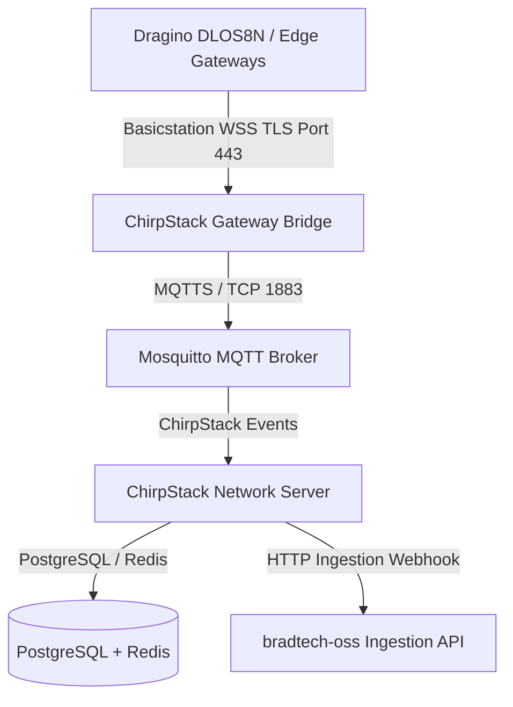

🏠 **[README](../../README.fr.md)** | 🗺️ **[Index Architecture](index.fr.md)** | ⬅️ **[Précédent : Sync ETL & Remplacement à Chaud](DATA_SYNC_AND_HOT_SWAP.fr.md)** | ➡️ **[Suivant : Recettes IaC Cloud & Edge](IAC_TERRAFORM_HELM_ARGOCD_PODMAN.fr.md)**
---

# Spécifications — Infrastructure LoRaWAN Souveraine & Outil CLI de Déploiement (`infra/lorawan-server` & `infra/tools`)

> 🌐 *English version available in [`SOVEREIGN_LORAWAN_AND_DEPLOYMENT_CLI.md`](SOVEREIGN_LORAWAN_AND_DEPLOYMENT_CLI.md)*

Ce document spécifie le serveur réseau LoRaWAN souverain embarqué **ChirpStack v4** (`infra/lorawan-server`) et l'outil CLI interactif de provisioning (`infra/tools`).

---

## 🛰️ 1. Schéma d'Architecture LoRaWAN Souverain

---

## 🛠️ 2. Sous-Systèmes Clés

### A. Pile Embariquée Souveraine (`infra/lorawan-server`)
- Serveur Réseau **ChirpStack v4** embarqué avec point de terminaison Basicstation WSS TLS.
- Filtrage par OUI IEEE des passerelles Brad (`8C:1F:64`).
- Base PostgreSQL et Mosquitto MQTT isolés dans des conteneurs non-root.

### B. Outil CLI de Configuration & Génération de Clés (`yarn setup`)
Assistant interactif générant les configurations spécifiques au site :
1. **Génération de Clés Secrètes** : Mots de passe PostgreSQL, secrets JWT, certificats TLS CA et Passerelles.
2. **Personnalisation des Manifestes** : Génération de `.env`, `podman-compose.site.yml` et `values-site.yaml`.
3. **Générateur d'Archive de Secours Passerelle Dragino** : Automatisation de la création de `dlos8n-config-site.tar.gz` contenant les certificats TLS WSS et adresses pré-configurées pour le flashage automatique des passerelles terrain.

---
🏠 **[README](../../README.fr.md)** | 🗺️ **[Index Architecture](index.fr.md)** | ⬅️ **[Précédent : Sync ETL & Remplacement à Chaud](DATA_SYNC_AND_HOT_SWAP.fr.md)** | ➡️ **[Suivant : Recettes IaC Cloud & Edge](IAC_TERRAFORM_HELM_ARGOCD_PODMAN.fr.md)**
