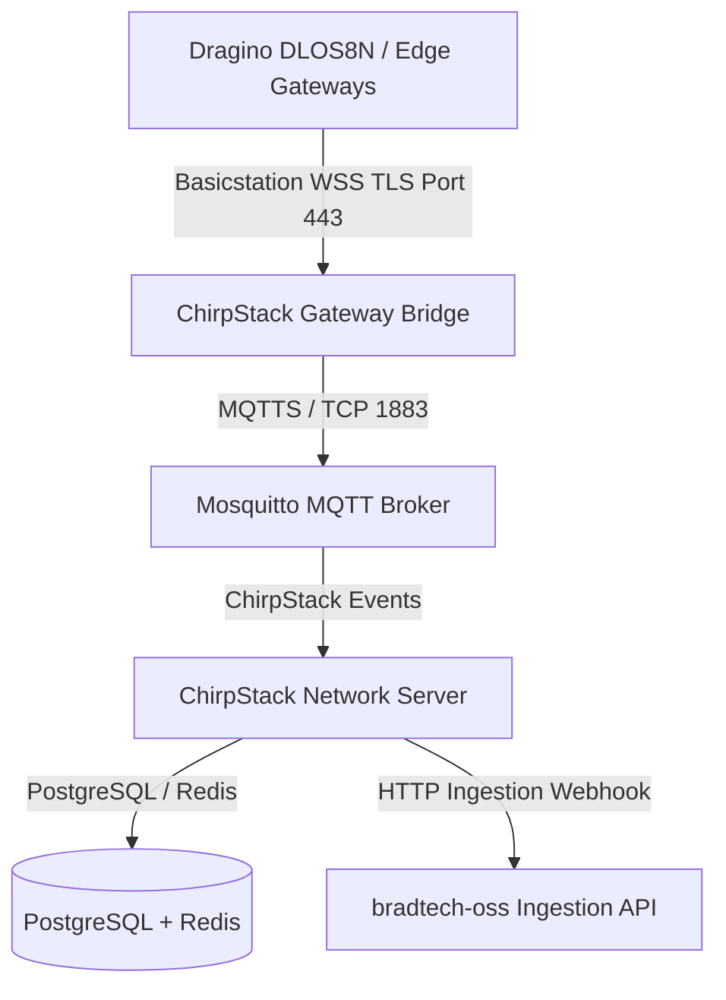

🏠 **[README](../../README.md)** | 🗺️ **[Architecture Index](index.md)** | ⬅️ **[Previous: Dual-System ETL Sync](DATA_SYNC_AND_HOT_SWAP.md)** | ➡️ **[Next: IaC Recipes](IAC_TERRAFORM_HELM_ARGOCD_PODMAN.md)**
---

# Specifications — Sovereign LoRaWAN Stack & Setup CLI Generator (`infra/lorawan-server` & `infra/tools`)

> 🌐 *Version française disponible dans [`SOVEREIGN_LORAWAN_AND_DEPLOYMENT_CLI.fr.md`](SOVEREIGN_LORAWAN_AND_DEPLOYMENT_CLI.fr.md)*

This document specifies the sovereign embedded **ChirpStack v4** network server stack (`infra/lorawan-server`) and the interactive setup CLI generator (`infra/tools`).

---

## 🛰️ 1. Sovereign LoRaWAN Architecture Diagram

---

## 🛠️ 2. Core Subsystems

### A. Sovereign Embedded Stack (`infra/lorawan-server`)
- Embedded **ChirpStack v4** Network Server with Basicstation WSS TLS endpoint.
- IEEE OUI filtering for Brad gateways (`8C:1F:64`).
- Local PostgreSQL & Mosquitto MQTT broker isolated inside non-root containers.

### B. Deployment Setup CLI (`yarn setup`)
Interactive wizard script creating site-specific configurations:
1. **Secret Generation**: Cryptographically secure PostgreSQL passwords, JWT secrets, TLS CA and Gateway certificates.
2. **Site Manifest Customization**: Generates `.env`, `podman-compose.site.yml`, and `values-site.yaml`.
3. **Dragino Backup Config Archive Builder**: Automates creation of `dlos8n-config-site.tar.gz` containing pre-configured Basicstation WSS TLS certificates and server addresses for automated gateway flashing.

---
🏠 **[README](../../README.md)** | 🗺️ **[Architecture Index](index.md)** | ⬅️ **[Previous: Dual-System ETL Sync](DATA_SYNC_AND_HOT_SWAP.md)** | ➡️ **[Next: IaC Recipes](IAC_TERRAFORM_HELM_ARGOCD_PODMAN.md)**
