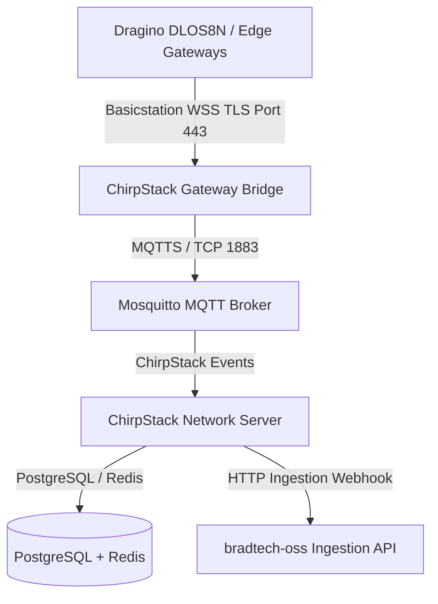

# Specifications — Sovereign LoRaWAN Stack & Setup CLI Generator

> 🌐 *Version française disponible dans [`SOVEREIGN_LORAWAN_AND_DEPLOYMENT_CLI.fr.md`](file:///Users/crapougnax/CODE/BRAD2026/bradtech-oss/docs/architecture/SOVEREIGN_LORAWAN_AND_DEPLOYMENT_CLI.fr.md)*

> [!NOTE]
> **Data Sovereignty & Secure Provisioning:** Complete integration of an embedded sovereign LoRaWAN server stack (*ChirpStack + Gateway Bridge WSS + Mosquitto*) and an interactive CLI tool for automated generation of site-customized secrets and deployment manifests.

---

## 🛰️ 1. Embedded Sovereign LoRaWAN Infrastructure (`infra/lorawan-server`)

Derived from the [`bradtech/lorawan-server`](file:///Users/crapougnax/CODE/BRAD2026/lorawan-server) repository, this module guarantees 100% on-premise data sovereignty for processing radio telemetry frames.



### Embedded Components
1. **ChirpStack v4 Network Server**: Sovereign management of OTAA joins, radio sessions, and frame deduplication.
2. **ChirpStack Gateway Bridge (Basicstation WSS)**: Secure WebSocket TLS (`wss://`) ingestion with edge-level IEEE OUI prefix filtering.
3. **Mosquitto MQTT Broker**: Isolated internal message broker.
4. **Dedicated PostgreSQL DB & Redis Cache**: Sovereign storage of device keys and active session tokens.

---

## 🛠️ 2. Deployment Setup CLI & Secret Provisioning Tool (`infra/tools/setup-cli`)

To guarantee secure, reproducible, and instantaneous deployments across new operational sites, the `@bradtech-oss/cli-setup` CLI tool handles:

### A. Automated Cryptographic Secret Generation
- Isolated, 32+ character random PostgreSQL database passwords.
- Cryptographic JWT secrets for Supabase and ChirpStack API endpoints.
- Automated creation of TLS Certificate Authorities (CA) and server certificates (or Let's Encrypt ISRG Root X1 integration).
- MQTT credential pairs and API keys.

### B. Per-Site Customization Options
The CLI prompts or accepts site-specific parameters:
- **Public/Private Domain Name** (e.g. `lorawan.example-farm.com`).
- **Filtered OUI / JoinEUI Prefixes** (e.g. `8C:1F:64`).
- **Spectrum Frequency Region** (e.g. `EU868`, `US915`).
- **Gateway & 3G/4G SIM Identifiers (APN, PIN, PUK, IMEI)**.

### C. Output Deployment Artifacts
Upon execution, the CLI automatically generates the complete deployment bundle:
- Encrypted site `.env` and `.env.secrets` files.
- Ready-to-use `infra/podman/podman-compose.site.yml`.
- Site-customized Helm `infra/helm/values-site.yaml`.
- `dlos8n-config-site.tar.gz`: Factory backup archive to restore directly into Dragino gateway management UI!

---

## 💻 CLI Tool Usage Example

```bash
cd "/Users/crapougnax/CODE/BRAD2026/bradtech-oss"

# Run interactive site deployment generator
yarn setup --site "avignon-farm" --domain "avignon.brad.ag" --region "EU868"
```

```text
⚙️ bradtech-oss Deployment Setup Tool
--------------------------------------------------
[1/5] 🔑 Generating 256-bit cryptographically secure secret keys... Done.
[2/5] 📜 Creating TLS Certificate Authority & Basicstation Certificates... Done.
[3/5] 🛰️ Configuring Sovereign LoRaWAN Server (ChirpStack EU868)... Done.
[4/5] 📦 Building custom Dragino DLOS8N config archive (dlos8n-config-avignon-farm.tar.gz)... Done.
[5/5] 🚀 Generating podman-compose.yml and Helm values-site.yaml... Done.

✨ Installation package ready in ./infra/dist/avignon-farm/
```
