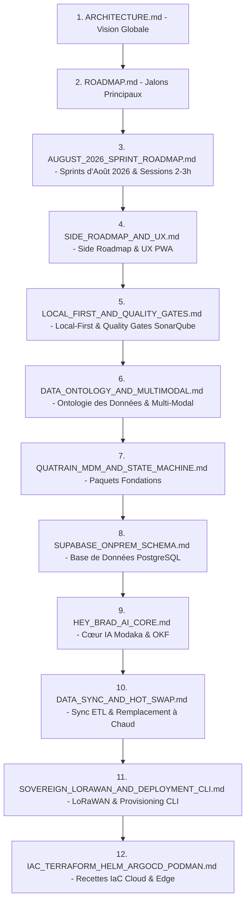

# Index de la Documentation d'Architecture — bradtech-oss

> 🌐 *English version available in [`index.md`](index.md)*

Ce document définit l'ordre de lecture recommandé pour appréhender l'ensemble de l'architecture, du modèle de données, de l'ontologie multi-modale, du cœur IA et des infrastructures du monorepo **`bradtech-oss`**.

---

## 📚 Ordre de Lecture Recommandé

---

## 📋 Table des Matières Détaillée

### 1. Vision & Cadre Général
1. 📐 **[Vue d'Ensemble & Principes Directeurs](ARCHITECTURE.fr.md)** (`ARCHITECTURE.fr.md`)
2. 🗺️ **[Feuille de Route Globale & Jalons](ROADMAP.fr.md)** (`ROADMAP.fr.md`)
3. 🗓️ **[Planning Détaillé d'Août 2026 (Sprints & Sessions de 2-3h)](AUGUST_2026_SPRINT_ROADMAP.fr.md)** (`AUGUST_2026_SPRINT_ROADMAP.fr.md`)
4. 🎯 **[Side Roadmap : Paquets Quatrain, Curation Bookworm, Hey Brad & UX PWA](SIDE_ROADMAP_AND_UX.fr.md)** (`SIDE_ROADMAP_AND_UX.fr.md`)

### 2. Architecture Local-First, Quality Gates & Ontologie des Données
5. 📱 **[Architecture Local-First, Quality Gates SonarQube & Outillage CI/CD](LOCAL_FIRST_AND_QUALITY_GATES.fr.md)** (`LOCAL_FIRST_AND_QUALITY_GATES.fr.md`)
6. 🏛️ **[Ontologie Structurée des Données & Observations Multi-Modales](DATA_ONTOLOGY_AND_MULTIMODAL.fr.md)** (`DATA_ONTOLOGY_AND_MULTIMODAL.fr.md`)
7. 📦 **[Spécifications `@quatrain/mdm` & `@quatrain/state-machine`](QUATRAIN_MDM_AND_STATE_MACHINE.fr.md)** (`QUATRAIN_MDM_AND_STATE_MACHINE.fr.md`)

### 3. Données, Synchronisation & Intelligence Artificielle
8. 🗄️ **[Schéma Supabase On-Premise PostgreSQL & RLS](SUPABASE_ONPREM_SCHEMA.fr.md)** (`SUPABASE_ONPREM_SCHEMA.fr.md`)
9. 🤖 **[Cœur IA "Hey Brad" (Moteur Modaka & Repositories OKF)](HEY_BRAD_AI_CORE.fr.md)** (`HEY_BRAD_AI_CORE.fr.md`)
10. 🔄 **[Moulinettes ETL, Synchronisation Bi-Système & Remplacement à Chaud (*Hot Swap*)](DATA_SYNC_AND_HOT_SWAP.fr.md)** (`DATA_SYNC_AND_HOT_SWAP.fr.md`)

### 4. Infrastructures, Souveraineté & Déploiement Cloud/Edge
11. 🛰️ **[Infrastructure LoRaWAN Souveraine & Outil CLI de Provisioning](SOVEREIGN_LORAWAN_AND_DEPLOYMENT_CLI.fr.md)** (`SOVEREIGN_LORAWAN_AND_DEPLOYMENT_CLI.fr.md`)
12. 🐳 **[Recettes IaC : Terraform, Helm, ArgoCD & Podman](IAC_TERRAFORM_HELM_ARGOCD_PODMAN.fr.md)** (`IAC_TERRAFORM_HELM_ARGOCD_PODMAN.fr.md`)
