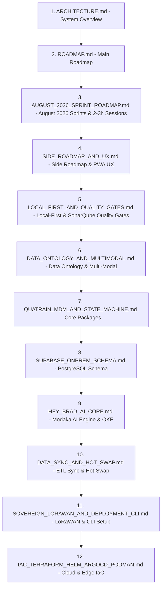

# Architecture Documentation Index — bradtech-oss

> 🌐 *French version available in [`index.fr.md`](file:///Users/crapougnax/CODE/BRAD2026/bradtech-oss/docs/architecture/index.fr.md)*

This document defines the recommended reading order to understand the architecture, data models, multi-modal ontology, AI core, and deployment infrastructures of the **`bradtech-oss`** monorepo.

---

## 📚 Recommended Reading Order

---

## 📋 Detailed Table of Contents

### 1. Vision & General Framework
1. 📐 **[System Architecture Overview & Core Principles](file:///Users/crapougnax/CODE/BRAD2026/bradtech-oss/docs/architecture/ARCHITECTURE.md)** (`ARCHITECTURE.md`)
2. 🗺️ **[Global Roadmap & Milestones](file:///Users/crapougnax/CODE/BRAD2026/bradtech-oss/docs/architecture/ROADMAP.md)** (`ROADMAP.md`)
3. 🗓️ **[Refined August 2026 Sprint Roadmap (Weekly Sprints & 2-3h Sessions)](file:///Users/crapougnax/CODE/BRAD2026/bradtech-oss/docs/architecture/AUGUST_2026_SPRINT_ROADMAP.md)** (`AUGUST_2026_SPRINT_ROADMAP.md`)
4. 🎯 **[Side Roadmap: Quatrain Packages, Bookworm Curation, Hey Brad & PWA UX](file:///Users/crapougnax/CODE/BRAD2026/bradtech-oss/docs/architecture/SIDE_ROADMAP_AND_UX.md)** (`SIDE_ROADMAP_AND_UX.md`)

### 2. Local-First Architecture, Quality Gates & Data Ontology
5. 📱 **[Local-First Architecture, SonarQube Quality Gates & CI/CD Tooling](file:///Users/crapougnax/CODE/BRAD2026/bradtech-oss/docs/architecture/LOCAL_FIRST_AND_QUALITY_GATES.md)** (`LOCAL_FIRST_AND_QUALITY_GATES.md`)
6. 🏛️ **[Structured Data Ontology & Multi-Modal Observations](file:///Users/crapougnax/CODE/BRAD2026/bradtech-oss/docs/architecture/DATA_ONTOLOGY_AND_MULTIMODAL.md)** (`DATA_ONTOLOGY_AND_MULTIMODAL.md`)
7. 📦 **[`@quatrain/mdm` & `@quatrain/state-machine` Specifications](file:///Users/crapougnax/CODE/BRAD2026/bradtech-oss/docs/architecture/QUATRAIN_MDM_AND_STATE_MACHINE.md)** (`QUATRAIN_MDM_AND_STATE_MACHINE.md`)

### 3. Data, Synchronization & Artificial Intelligence
8. 🗄️ **[Supabase On-Premise PostgreSQL Schema & RLS](file:///Users/crapougnax/CODE/BRAD2026/bradtech-oss/docs/architecture/SUPABASE_ONPREM_SCHEMA.md)** (`SUPABASE_ONPREM_SCHEMA.md`)
9. 🤖 **["Hey Brad" AI Core Engine (Modaka & OKF Repositories)](file:///Users/crapougnax/CODE/BRAD2026/bradtech-oss/docs/architecture/HEY_BRAD_AI_CORE.md)** (`HEY_BRAD_AI_CORE.md`)
10. 🔄 **[ETL Migration Pipelines, Dual-System Sync & Hot Swap](file:///Users/crapougnax/CODE/BRAD2026/bradtech-oss/docs/architecture/DATA_SYNC_AND_HOT_SWAP.md)** (`DATA_SYNC_AND_HOT_SWAP.md`)

### 4. Infrastructure, Data Sovereignty & Cloud/Edge Deployments
11. 🛰️ **[Sovereign LoRaWAN Stack & Setup CLI Generator](file:///Users/crapougnax/CODE/BRAD2026/bradtech-oss/docs/architecture/SOVEREIGN_LORAWAN_AND_DEPLOYMENT_CLI.md)** (`SOVEREIGN_LORAWAN_AND_DEPLOYMENT_CLI.md`)
12. 🐳 **[IaC Recipes: Terraform, Helm, ArgoCD & Podman](file:///Users/crapougnax/CODE/BRAD2026/bradtech-oss/docs/architecture/IAC_TERRAFORM_HELM_ARGOCD_PODMAN.md)** (`IAC_TERRAFORM_HELM_ARGOCD_PODMAN.md`)
